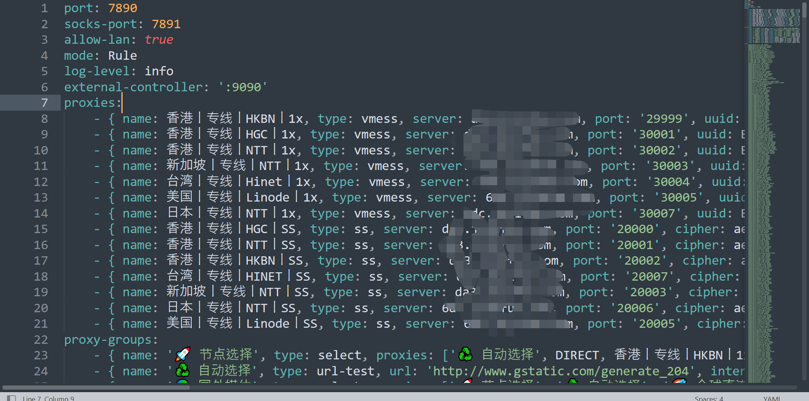
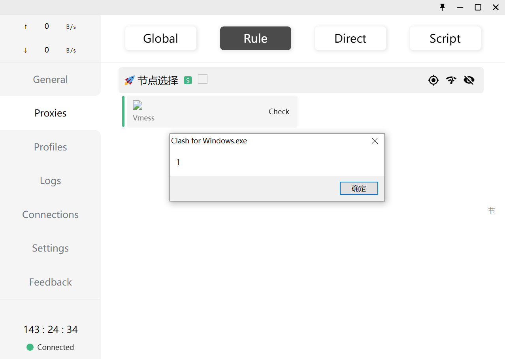
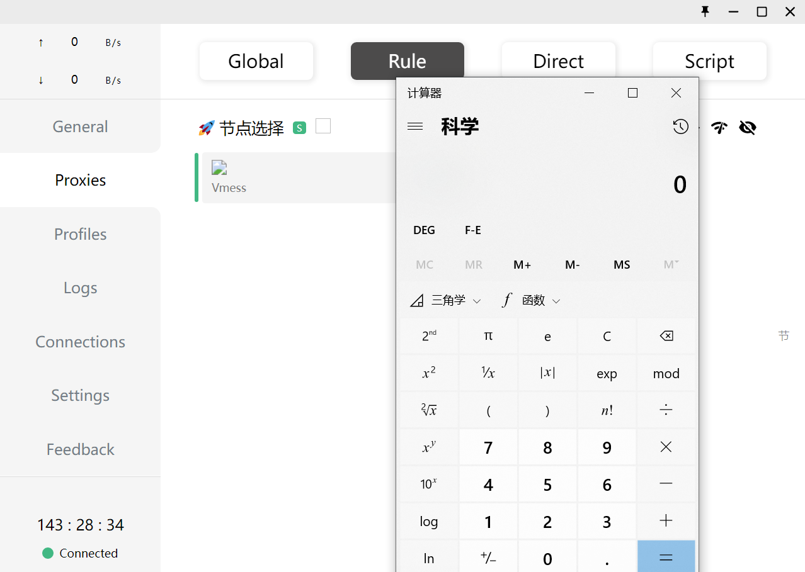
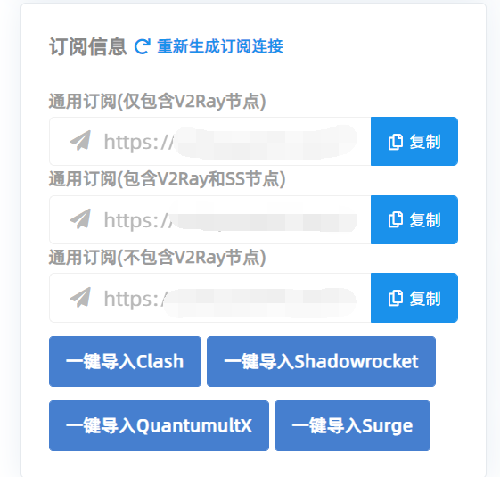

# Clash For Windows Rce

## 前言

23号Clash for windows爆出了rce的漏洞，我听到的时候也是一懵，因为clash for windows是自己一直在用的代理客户端，而且相信使用windows的大多数人的代理客户端用的也都是clash for windows，涉及人数也还是比较广的，所以立刻查找了相关的资料来了解这个rce。

## Clash for windows简介

Clash 是一个使用 Go 语言编写，基于规则的跨平台代理软件核心程序，而Clash for Windows 是目前在 Windows 上唯一可用的图形化 Clash 分支。通过 Clash API 来配置和控制 Clash 核心程序，便于用户可视化操作和使用。其支持众多协议，例如Vmess, Shadowsocks, Snell , SOCKS5 , ShadowsocksR等，是一款非常强大的代理客户端：


至于代理是干什么的，就不必多说了hhh。


## 漏洞分析

漏洞说白了就是开发没有对于输入进行合理的过滤导致了XSS到RCE的发生。

我对于这类型的情况最早的了解是在大家都在用的蚁剑的RCE，具体可以参考evoa的文章：[蚁剑客户端RCE的挖掘过程及Electron安全](https://evoa.me/archives/3/ )

简单来说就是，蚁剑是基于Electron开发的，而Electron应用最大的问题就是从XSS到RCE的攻击。之前的蚁剑就是因为没有对输入进行合适的过滤导致了xss到rce：


而Clash for windows的开发显然也在这方面没有做好。

这里以我自己的代理的yml文件为例：



在Proxies中展示是这样的：


可以发现，proxies的name，还有proxy-groups的name都被展示到了前端，是否存在xss漏洞呢？本地写1个yml文件来测试一下：

```yml
port: 7890
socks-port: 7891
allow-lan: true
mode: Rule
log-level: info
external-controller: ':9090'
proxies:
    - { name: , type: vmess, server: 123, port: '29999', uuid: B00EC15A-B535-411D-95D6-CAEA028C477F, alterId: 0, cipher: auto, udp: false }
proxy-groups:
    - { name: '🚀 节点选择', type: select, proxies: [] }

```

选择：


切到Proxies，弹窗，说明XSS存在：



改成rce：

```yml
port: 7890
socks-port: 7891
allow-lan: true
mode: Rule
log-level: info
external-controller: ':9090'
proxies:
    - { name: , type: vmess, server: 123, port: '29999', uuid: B00EC15A-B535-411D-95D6-CAEA028C477F, alterId: 0, cipher: auto, udp: false }
proxy-groups:
    - { name: '🚀 节点选择', type: select, proxies: [] }

```

成功弹出计算器：



## 利用

乍一看这似乎是self-xss，但是要知道配置文件要么是自己写，要么是直接download的：


因为真正的会去学习自己写配置文件的人可能只有非常小的一部分，所以大部分的代理自身提供了clash for windows的配置下载url，比如我的代理：



因此此漏洞以后更多可能会在钓鱼中被利用，比如假冒成免费的代理供应商，总会有人贪图免费的代理然后去clash for windows上下载对应的url然后使用导致了rce。


另外一种利用就是issue中提到的比如这样的`clash://install-config?url=http://xxx/1.cfg`

如果我把恶意的配置文件写到了服务器上，如果受害者的浏览器点击了这个链接就会自动打开clash for windows来下载此配置文件并使用，唯一的问题可能就是，会有提示：


能想到的利用方式可能就是用于钓鱼网站了，比如302跳转的网站，点进去就自动跳转到`clash://`这样的，一旦点击者没有安全意识的话，很容易会中招。

## 影响版本

根据github上issue的说法以及releases等的说法，真正的修复了这个XSS漏洞应该是在[v 0.19.10](https://github.com/Fndroid/clash_for_windows_pkg/releases/tag/0.19.10)，也就是说在此版本之前的Clash for windows都存在RCE漏洞，非常危险。

## 参考

https://github.com/Fndroid/clash_for_windows_pkg/issues/2710